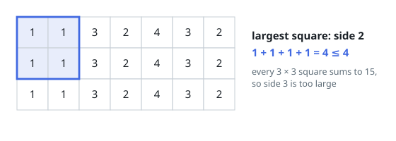

# Maximum Side Length of a Square with Sum Less than or Equal to Threshold

## Description

Given a `m x n` matrix `mat` and an integer `threshold`, return the maximum
side-length of a square with a sum less than or equal to `threshold` or return
`0` if there is no such square.

### Example 1

```text
Input: mat = [[1,1,3,2,4,3,2],[1,1,3,2,4,3,2],[1,1,3,2,4,3,2]], threshold = 4
Output: 2
Explanation: The maximum side length of square with sum less than or equal
to 4 is 2 as shown.
```



### Example 2

```text
Input: mat = [[2,2,2,2,2],[2,2,2,2,2],[2,2,2,2,2],[2,2,2,2,2],[2,2,2,2,2]], threshold = 1
Output: 0
```

### Constraints

- `m == mat.length`
- `n == mat[i].length`
- `1 <= m, n <= 300`
- `0 <= mat[i][j] <= 10^4`
- `0 <= threshold <= 10^5`

## Hints

### Hint 1

Store prefix sum of all grids in another 2D array.

### Hint 2

Try all possible solutions and if you cannot find one return 0.

### Hint 3

If x is a valid answer then any y < x is also valid answer. Use binary search to find answer.
