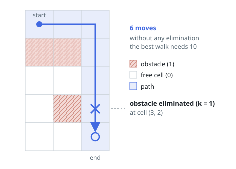
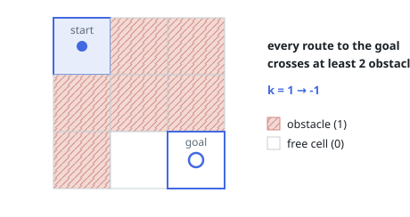

# Shortest Path in a Grid with Obstacles Elimination

## Description

You are given an `m x n` integer matrix `grid` where each cell is either `0`
(empty) or `1` (obstacle). You can move up, down, left, or right from and to
an empty cell in one step.

Return the minimum number of steps to walk from the upper left corner
`(0, 0)` to the lower right corner `(m - 1, n - 1)` given that you can
eliminate at most `k` obstacles. If it is not possible to find such a walk,
return `-1`.

### Example 1

```text
Input: grid = [[0,0,0],[1,1,0],[0,0,0],[0,1,1],[0,0,0]], k = 1
Output: 6
Explanation: The shortest path without eliminating any obstacle is 10.
The shortest path with one obstacle elimination at position (3,2) is 6.
Such path is (0,0) -> (0,1) -> (0,2) -> (1,2) -> (2,2) -> (3,2) -> (4,2).
```



### Example 2

```text
Input: grid = [[0,1,1],[1,1,1],[1,0,0]], k = 1
Output: -1
Explanation: We need to eliminate at least two obstacles to find such a walk.
```



### Constraints

- `m == grid.length`
- `n == grid[i].length`
- `1 <= m, n <= 40`
- `1 <= k <= m * n`
- `grid[i][j]` is either `0` or `1`.
- `grid[0][0] == grid[m - 1][n - 1] == 0`

## Hints

### Hint 1

Use BFS.

### Hint 2

Run the BFS over states (x, y, r) where x, y is the coordinate and r is the remaining number of obstacles you can still eliminate.

### Hint 3

If k is at least m + n - 2, the answer is simply m + n - 2 since you can eliminate every obstacle on a monotone path.
