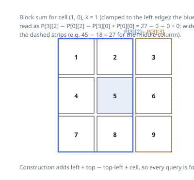

# Solutions — Matrix Block Sum

## Two-Dimensional Prefix Sums

The solution builds a (m+1) × (n+1) table where `prefix[i+1][j+1]` is the sum of all elements in the rectangle from (0,0) to (i,j). Each entry combines the prefix above, the prefix to the left, adds the current cell, and subtracts the doubly-counted corner — inclusion–exclusion in two dimensions. The extra zero row and column mean boundary cells need no special casing during construction.

Each requested block sum is then a rectangle query. The window for cell (i, j) spans rows `i−k .. i+k` and columns `j−k .. j+k`; the code clamps those bounds to `[0, m)` and `[0, n)` and converts the inclusive row range to the half-open form `[r1, r2)` the table supports. Four lookups with alternating signs give the block sum in O(1), regardless of k.

The clamping is what handles borders: cells near an edge simply query a smaller rectangle, which is exactly the problem's definition of summing only valid positions. When k is large enough to cover the matrix, every cell returns the total sum, as in the k = 2 example.

**Complexity:** `O(m · n)` time, `O(m · n)` space.
