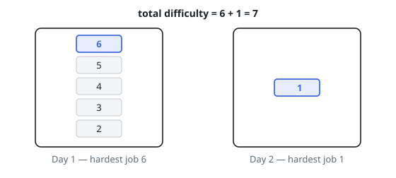

# Minimum Difficulty of a Job Schedule

## Description

You want to schedule a list of jobs in `d` days. Jobs are dependent (i.e.
to work on the `i`-th job, you have to finish all the jobs `j` where
`0 <= j < i`).

You have to finish at least one task every day. The difficulty of a job
schedule is the sum of difficulties of each day of the `d` days. The
difficulty of a day is the maximum difficulty of a job done on that day.

You are given an integer array `jobDifficulty` and an integer `d`. The
difficulty of the `i`-th job is `jobDifficulty[i]`.

Return the minimum difficulty of a job schedule. If you cannot find a
schedule for the jobs, return `-1`.

### Example 1

```text
Input: jobDifficulty = [6,5,4,3,2,1], d = 2
Output: 7
Explanation: First day you can finish the first 5 jobs, total difficulty = 6.
Second day you can finish the last job, total difficulty = 1.
The difficulty of the schedule = 6 + 1 = 7.
```



### Example 2

```text
Input: jobDifficulty = [9,9,9], d = 4
Output: -1
Explanation: If you finish a job per day you will still have a free day.
You cannot find a schedule for the given jobs.
```

### Example 3

```text
Input: jobDifficulty = [1,1,1], d = 3
Output: 3
Explanation: The schedule is one job per day. Total difficulty will be 3.
```

### Constraints

- `1 <= jobDifficulty.length <= 300`
- `0 <= jobDifficulty[i] <= 1000`
- `1 <= d <= 10`

## Hints

### Hint 1

Use DP: cut the array into d non-empty sub-arrays and try all possible cuts.

### Hint 2

Let dp[i][j] be the minimum difficulty of scheduling the first j jobs in i days; the cost added by the last day is the maximum difficulty over its block of jobs.

### Hint 3

The complexity is O(n * n * d); if n < d the answer is -1.
