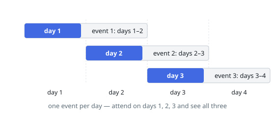

# Maximum Number of Events That Can Be Attended

## Description

You are given an array of `events` where `events[i] = [startDayi, endDayi]`.
Every event `i` starts at `startDayi` and ends at `endDayi`.

You can attend an event `i` at any day `d` where `startDayi <= d <= endDayi`.
You can only attend one event at any time `d`.

Return the maximum number of events you can attend.

### Example 1

```text
Input: events = [[1,2],[2,3],[3,4]]
Output: 3
Explanation: You can attend all three events.
One way: attend the first event on day 1, the second event on day 2,
and the third event on day 3.
```



### Example 2

```text
Input: events = [[1,2],[2,3],[3,4],[1,2]]
Output: 4
```

### Constraints

- `1 <= events.length <= 10^5`
- `events[i].length == 2`
- `1 <= startDayi <= endDayi <= 10^5`

## Hints

### Hint 1

Sort the events by start time.

### Hint 2

Sweep day by day: add all events that have started to a min-heap keyed by end day.

### Hint 3

Each day, drop events whose end day has already passed and attend the event that ends earliest.
