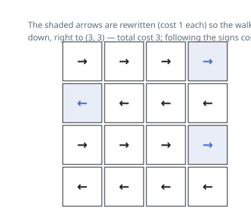

# Solutions — Minimum Cost to Make at Least One Valid Path in a Grid

## 0-1 BFS with a deque

Rephrase the task as a shortest-path problem: each cell is a node, and moving from cell `(i, j)` to each of its four side-neighbors costs 0 if the cell's sign points at that neighbor and 1 otherwise — the price of rewriting the sign. The answer is the cheapest total edge weight on any path from `(0, 0)` to `(m - 1, n - 1)`, and since every weight is 0 or 1, Dijkstra collapses into 0-1 BFS: maintain a deque and always expand the node at the front, which is guaranteed to carry the current smallest distance.

The relaxation is what keeps the deque ordered by distance. When a neighbor is improved through a 0-weight edge it is pushed to the front (`appendleft`), and through a 1-weight edge to the back (`append`) — so within the queue the distances never decrease from front to back by more than the single unit that separates the two halves, and each node is settled the first time it is popped. Nodes may be re-pushed when a strictly smaller distance is later found, but the `dist` table prevents any worse expansion.

The walk over the input is a single `dirs` map from sign values 1-4 to their `(di, dj)` offsets; each dequeued cell tries all four directions, so every cell-cell adjacency is examined at most a constant number of times per improvement. The start cell begins with distance 0 and no sign needs rewriting merely to enter it.

Edge cases: a 1x1 grid returns 0 immediately (start equals goal), and signs pointing off the grid are simply never followed — the bounds check drops those moves, and if no other route exists the cost of redirecting such a sign is exactly the 1-weight edge into an interior neighbor.

**Complexity:** `O(m * n)` time, `O(m * n)` space.
