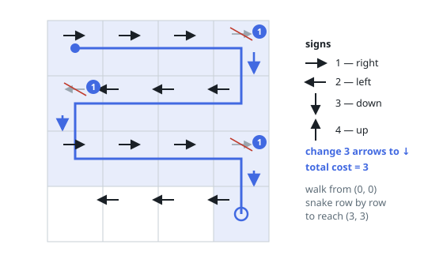
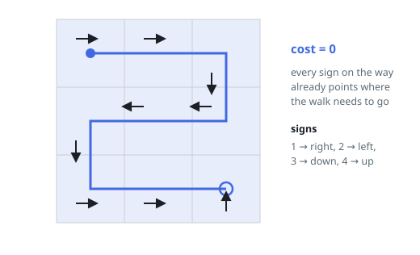
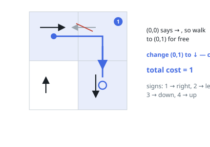

# Minimum Cost to Make at Least One Valid Path in a Grid

## Description

Given an `m x n` grid. Each cell of the grid has a sign pointing to the next
cell you should visit if you are currently in this cell. The sign of
`grid[i][j]` can be:

- `1` which means go to the cell to the right (i.e. go from `grid[i][j]` to
  `grid[i][j + 1]`)
- `2` which means go to the cell to the left (i.e. go from `grid[i][j]` to
  `grid[i][j - 1]`)
- `3` which means go to the lower cell (i.e. go from `grid[i][j]` to
  `grid[i + 1][j]`)
- `4` which means go to the upper cell (i.e. go from `grid[i][j]` to
  `grid[i - 1][j]`)

Notice that there could be some signs on the cells of the grid that point
outside the grid.

You will initially start at the upper left cell `(0, 0)`. A valid path in
the grid is a path that starts from the upper left cell `(0, 0)` and ends at
the bottom-right cell `(m - 1, n - 1)` following the signs on the grid. The
valid path does not have to be the shortest.

You can modify the sign on a cell with `cost = 1`. You can modify the sign
on a cell one time only.

Return the minimum cost to make the grid have at least one valid path.

### Example 1

```text
Input: grid = [[1,1,1,1],[2,2,2,2],[1,1,1,1],[2,2,2,2]]
Output: 3
Explanation: You will start at point (0, 0).
The path to (3, 3) is as follows. (0, 0) --> (0, 1) --> (0, 2) --> (0, 3) change the arrow to down with cost = 1 --> (1, 3) --> (1, 2) --> (1, 1) --> (1, 0) change the arrow to down with cost = 1 --> (2, 0) --> (2, 1) --> (2, 2) --> (2, 3) change the arrow to down with cost = 1 --> (3, 3).
The total cost = 3.
```



### Example 2

```text
Input: grid = [[1,1,3],[3,2,2],[1,1,4]]
Output: 0
Explanation: You can follow the path from (0, 0) to (2, 2).
```



### Example 3

```text
Input: grid = [[1,2],[4,3]]
Output: 1
```



### Constraints

- `m == grid.length`
- `n == grid[i].length`
- `1 <= m, n <= 100`
- `1 <= grid[i][j] <= 4`

## Hints

### Hint 1

Build a graph where each cell connects to its four side-adjacent cells with a weighted edge: weight 0 if the cell's sign points at that neighbor, 1 otherwise.

### Hint 2

Run 0-1 BFS (or Dijkstra) from (0, 0); the answer is the distance to (m - 1, n - 1).
