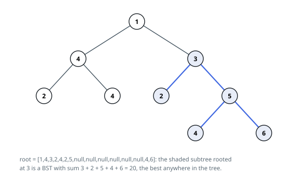

# Solutions — Maximum Sum BST in Binary Tree

## Post-order DFS returning (is_bst, min, max, sum)

Whether a subtree rooted at `node` is a BST is decided bottom-up: both children must be BSTs, every key in the left subtree must be smaller than `node.val`, and every key in the right subtree larger. Checking "every key" naively rescans subtrees; instead a single post-order pass makes each node return a four-tuple `(is_bst, min_val, max_val, subtree_sum)`, so the parent validates in O(1) against the child's extreme values — `left.max < node.val < right.min` — and combines the sums.

When either child fails its BST test, or a bound check fails, the node propagates `(False, 0, 0, 0)` so every ancestor above it is also disqualified as a BST root — a subtree containing an invalid subtree cannot itself be valid. When the checks pass, the node computes its own range as the leftmost leaf's value on the left (or `node.val` for an empty child, encoded as `None`) and the rightmost on the right, plus `total = left.sum + right.sum + node.val`. At that moment `total` is the key sum of a genuine BST subtree, so a global `best` is updated.

Empty children return `(True, None, None, 0)`: an empty tree is trivially a BST, and `None` bounds are skipped by the `is not None` guards, which also lets a leaf report its own value as both min and max. This avoids sentinel sentinels like infinity that could collide with the real value range of `-4 * 10^4 .. 4 * 10^4`.

The answer starts at 0 rather than minus infinity because the problem counts the empty BST as an allowed fallback: when every BST subtree has a negative sum (a tree of all-negative keys), the correct result is 0, and no valid subtree ever updates `best` above it. Each node is visited exactly once.

**Complexity:** `O(n)` time, `O(n)` space (recursion stack, `O(h)` for balanced trees).
