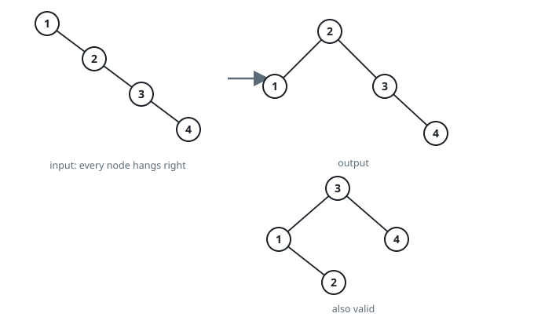
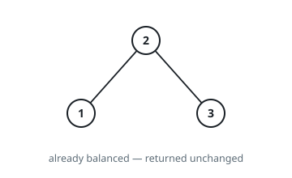

# Balance a Binary Search Tree

## Description

Given the root of a binary search tree, return a balanced binary search tree with the same node values. If there is more than one answer, return any of them.

A binary search tree is balanced if the depth of the two subtrees of every node never differs by more than 1.

### Example 1

```text
Input: root = [1,null,2,null,3,null,4,null,null]
Output: [2,1,3,null,null,null,4]
Explanation: This is not the only correct answer, [3,1,4,null,2] is also correct.
```



### Example 2

```text
Input: root = [2,1,3]
Output: [2,1,3]
```



### Constraints

- The number of nodes in the tree is in the range `[1, 10⁴]`.
- `1 <= Node.val <= 10⁵`

## Hints

### Hint 1

Convert the tree to a sorted array using an in-order traversal.

### Hint 2

Construct a new balanced tree from the sorted array recursively.
