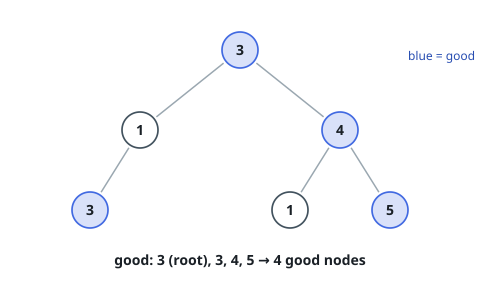
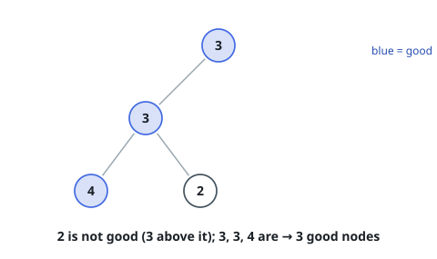

# Count Good Nodes in Binary Tree

## Description

Given a binary tree `root`, a node `X` in the tree is named good if in the
path from root to `X` there are no nodes with a value greater than `X`.

Return the number of good nodes in the binary tree.

### Example 1

```text
Input: root = [3,1,4,3,null,1,5]
Output: 4
Explanation: Nodes in blue are good.
Root Node (3) is always a good node.
Node 4 -> (3,4) is the maximum value in the path starting from the root.
Node 5 -> (3,4,5) is the maximum value in the path.
Node 3 -> (3,1,3) is the maximum value in the path.
```



### Example 2

```text
Input: root = [3,3,null,4,2]
Output: 3
Explanation: Node 2 -> (3, 3, 2) is not good, because 3 is higher than it.
```



### Example 3

```text
Input: root = [1]
Output: 1
Explanation: Root is considered as good.
```

### Constraints

- The number of nodes in the binary tree is in the range `[1, 10^5]`.
- Each node's value is between `[-10^4, 10^4]`.

## Hints

### Hint 1

Use DFS (Depth First Search) to traverse the tree, and constantly keep track of the current path maximum.

### Hint 2

A node is good when its value is greater than or equal to the path maximum; equal values count as good.

### Hint 3

Pass the updated maximum down to each child, and sum the good-node counts from both subtrees.
