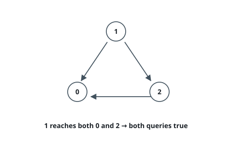

# Course Schedule IV

## Description

There are a total of `numCourses` courses you have to take, labeled from `0`
to `numCourses - 1`. You are given an array `prerequisites` where
`prerequisites[i] = [a_i, b_i]` indicates that you must take course `a_i`
first if you want to take course `b_i`.

For example, the pair `[0, 1]` indicates that you have to take course `0`
before you can take course `1`.

Prerequisites can also be indirect. If course `a` is a prerequisite of course
`b`, and course `b` is a prerequisite of course `c`, then course `a` is a
prerequisite of course `c`.

You are also given an array `queries` where `queries[j] = [u_j, v_j]`. For
the `j`-th query, you should answer whether course `u_j` is a prerequisite of
course `v_j` or not.

Return a boolean array `answer` where `answer[j]` is the answer to the `j`-th
query.

### Example 1

```text
Input: numCourses = 2, prerequisites = [[1,0]], queries = [[0,1],[1,0]]
Output: [false,true]
Explanation: The pair [1, 0] indicates that you have to take course 1 before
you can take course 0.
Course 0 is not a prerequisite of course 1, but the opposite is true.
```

![Two courses with the single arrow 1 to 0, so only the query [1,0] is true.](figures/example-1.svg)

### Example 2

```text
Input: numCourses = 2, prerequisites = [], queries = [[1,0],[0,1]]
Output: [false,false]
Explanation: There are no prerequisites, and each course is independent.
```

### Example 3

```text
Input: numCourses = 3, prerequisites = [[1,2],[1,0],[2,0]], queries = [[1,0],[1,2]]
Output: [true,true]
Explanation: The pair [1, 2] indicates you must take course 1 before course 2.
The pair [1, 0] indicates you must take course 1 before course 0.
So course 1 is a prerequisite of both courses 0 and 2.
```



### Constraints

- `2 <= numCourses <= 100`
- `0 <= prerequisites.length <= numCourses * (numCourses - 1) / 2`
- `prerequisites[i].length == 2`
- `0 <= a_i, b_i <= numCourses - 1`
- `a_i != b_i`
- All the pairs `[a_i, b_i]` are unique.
- The prerequisites graph has no cycles.
- `1 <= queries.length <= 10⁴`
- `0 <= u_j, v_j <= numCourses - 1`
- `u_j != v_j`

## Hints

### Hint 1

The answer to a query is a reachability question on a DAG: course `u` is a
prerequisite of course `v` exactly when there is a directed path from `u` to
`v` following the pairs as edges `a -> b`.

### Hint 2

Precompute all reachability at once instead of running a search per query.
Process the courses in topological order and give each course the set of all
courses that reach it: when you pop a course, merge its set (plus itself)
into the set of every course that depends on it.

### Hint 3

Since `numCourses <= 100`, each reachable-set fits comfortably in a bitset,
so one merge is a cheap bitwise OR of a few machine words — the whole
precomputation is fast even for the largest graph.
