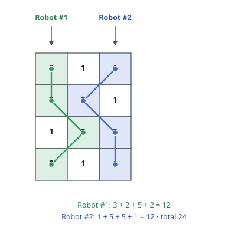
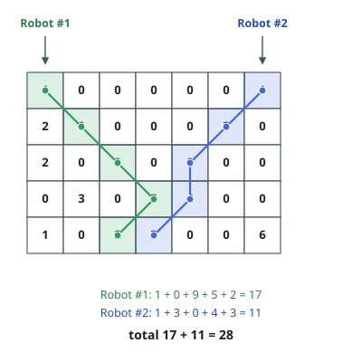

# Cherry Pickup II

## Description

You are given a `rows x cols` matrix `grid` representing a field of cherries
where `grid[i][j]` represents the number of cherries that you can collect from
the `(i, j)` cell.

You have two robots that can collect cherries for you:

- Robot #1 is located at the top-left corner `(0, 0)`, and
- Robot #2 is located at the top-right corner `(0, cols - 1)`.

Return the maximum number of cherries collection using both robots by
following the rules below:

- From a cell `(i, j)`, robots can move to cell `(i + 1, j - 1)`,
  `(i + 1, j)`, or `(i + 1, j + 1)`.
- When any robot passes through a cell, it picks up all cherries, and the cell
  becomes an empty cell.
- When both robots stay in the same cell, only one takes the cherries.
- Both robots cannot move outside of the grid at any moment.
- Both robots should reach the bottom row in the grid.

### Example 1

```text
Input: grid = [[3,1,1],[2,5,1],[1,5,5],[2,1,1]]
Output: 24
Explanation: Path of robot #1 and #2 are described in color green and blue respectively.
Cherries taken by Robot #1, (3 + 2 + 5 + 2) = 12.
Cherries taken by Robot #2, (1 + 5 + 5 + 1) = 12.
Total of cherries: 12 + 12 = 24.
```



### Example 2

```text
Input: grid = [[1,0,0,0,0,0,1],[2,0,0,0,0,3,0],[2,0,9,0,0,0,0],[0,3,0,5,4,0,0],[1,0,2,3,0,0,6]]
Output: 28
Explanation: Path of robot #1 and #2 are described in color green and blue respectively.
Cherries taken by Robot #1, (1 + 9 + 5 + 2) = 17.
Cherries taken by Robot #2, (1 + 3 + 4 + 3) = 11.
Total of cherries: 17 + 11 = 28.
```



### Constraints

- `rows == grid.length`
- `cols == grid[i].length`
- `2 <= rows, cols <= 70`
- `0 <= grid[i][j] <= 100`

## Hints

### Hint 1

Use dynamic programming: define DP[i][j][k] as the maximum cherries both robots can take starting on the ith row, at columns j and k of robots 1 and 2 respectively.

### Hint 2

Both robots always move to the next row together, so process the grid row by row; when both robots are on the same cell, count its cherries only once.
