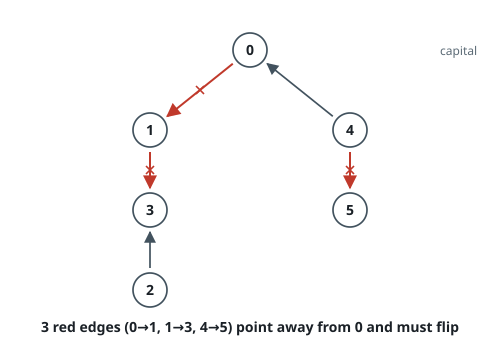
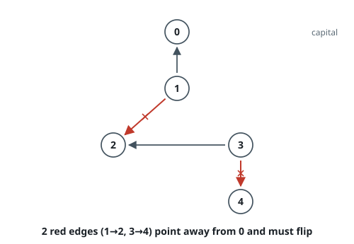

# Reorder Routes to Make All Paths Lead to the City Zero

## Description

There are `n` cities numbered from `0` to `n - 1` and `n - 1` roads
such that there is only one way to travel between two different cities
(this network forms a tree). Last year, the ministry of transport decided to
orient the roads in one direction because they are too narrow.

Roads are represented by `connections` where `connections[i] = [ai, bi]`
represents a road from city `ai` to city `bi`.

This year, there will be a big event in the capital (city 0), and many people
want to travel to this city.

Your task consists of reorienting some roads such that each city can visit
the city 0. Return the minimum number of edges changed.

It is guaranteed that each city can reach city 0 after reorder.

### Example 1

```text
Input: n = 6, connections = [[0,1],[1,3],[2,3],[4,0],[4,5]]
Output: 3
Explanation: Change the direction of edges shown in red such that each node can reach the node 0 (capital).
```



### Example 2

```text
Input: n = 5, connections = [[1,0],[1,2],[3,2],[3,4]]
Output: 2
Explanation: Change the direction of edges shown in red such that each node can reach the node 0 (capital).
```



### Example 3

```text
Input: n = 3, connections = [[1,0],[2,0]]
Output: 0
```

### Constraints

- `2 <= n <= 5 * 10^4`
- `connections.length == n - 1`
- `connections[i].length == 2`
- `0 <= ai, bi <= n - 1`
- `ai != bi`

## Hints

### Hint 1

Treat the graph as an undirected tree rooted at city 0.

### Hint 2

Traverse from node 0 with DFS or BFS; whenever you follow an edge in its original directed orientation (away from 0), it must be reversed.

### Hint 3

The answer is simply the count of original edges pointing away from the root during the traversal.
