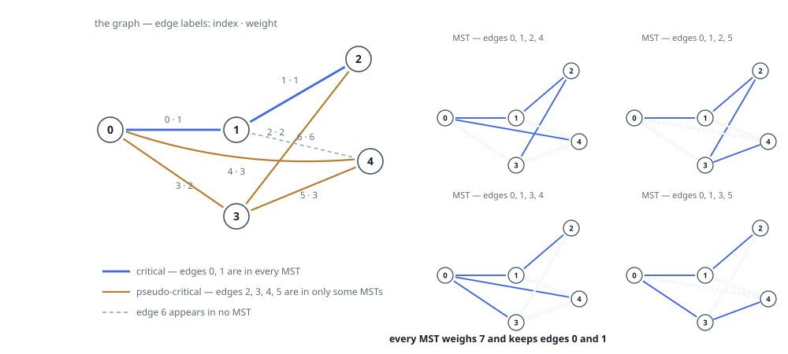
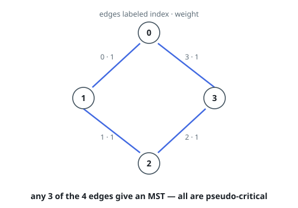

# Find Critical and Pseudo-Critical Edges in Minimum Spanning Tree

## Description

Given a weighted undirected connected graph with `n` vertices numbered from `0`
to `n - 1`, and an array `edges` where `edges[i] = [ai, bi, weighti]`
represents a bidirectional and weighted edge between nodes `ai` and `bi`. A
minimum spanning tree (MST) is a subset of the graph's edges that connects all
vertices without cycles and with the minimum possible total edge weight.

Find all the critical and pseudo-critical edges in the given graph's minimum
spanning tree (MST). An MST edge whose deletion from the graph would cause the
MST weight to increase is called a critical edge. On the other hand, a
pseudo-critical edge is that which can appear in some MSTs but not all.

Note that you can return the indices of the edges in any order.

### Example 1

```text
Input: n = 5, edges = [[0,1,1],[1,2,1],[2,3,2],[0,3,2],[0,4,3],[3,4,3],[1,4,6]]
Output: [[0,1],[2,3,4,5]]
Explanation: Notice that the two edges 0 and 1 appear in all MSTs, therefore they are critical edges, so we return them in the first list of the output. The edges 2, 3, 4, and 5 are only part of some MSTs, therefore they are considered pseudo-critical edges. We add them to the second list of the output.
```



### Example 2

```text
Input: n = 4, edges = [[0,1,1],[1,2,1],[2,3,1],[0,3,1]]
Output: [[],[0,1,2,3]]
Explanation: We can observe that since all 4 edges have equal weight, choosing any 3 edges from the given 4 will yield an MST. Therefore all 4 edges are pseudo-critical.
```



### Constraints

- `2 <= n <= 100`
- `1 <= edges.length <= min(200, n * (n - 1) / 2)`
- `edges[i].length == 3`
- `0 <= ai < bi < n`
- `1 <= weighti <= 1000`
- All pairs `(ai, bi)` are distinct.

## Hints

### Hint 1

Use the Kruskal algorithm to find the minimum spanning tree by sorting the edges and picking edges from ones with smaller weights.

### Hint 2

Use a disjoint set to avoid adding redundant edges that result in a cycle.

### Hint 3

To find if one edge is critical, delete that edge and re-run the MST algorithm and see if the weight of the new MST increases.

### Hint 4

To find if one edge is non-critical (in any MST), include that edge to the accepted edge list and continue the MST algorithm, then see if the resulting MST has the same weight of the initial MST of the entire graph.
