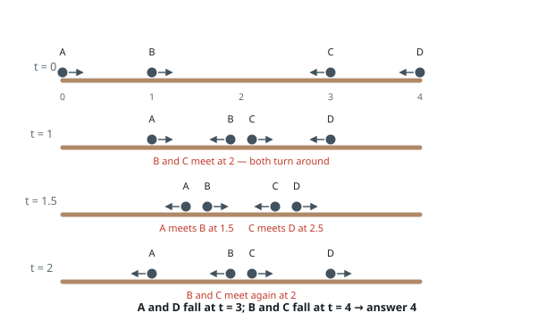
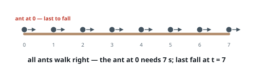
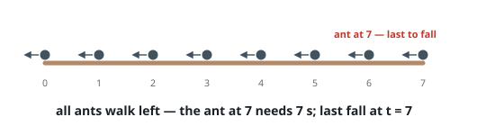

# Last Moment Before All Ants Fall Out of a Plank

## Description

We have a wooden plank of the length `n` units. Some ants are walking on
the plank, each ant moves with a speed of 1 unit per second. Some of the ants
move to the left, the others move to the right.

When two ants moving in two different directions meet at some point, they
change their directions and continue moving again. Assume changing directions
does not take any additional time.

When an ant reaches one end of the plank at a time `t`, it falls out of the
plank immediately.

Given an integer `n` and two integer arrays `left` and `right`, the positions
of the ants moving to the left and to the right, return the moment when the
last ant(s) fall out of the plank.

### Example 1

```text
Input: n = 4, left = [4,3], right = [0,1]
Output: 4
Explanation:
- The ant at index 0 is named A and is going to the right.
- The ant at index 1 is named B and is going to the right.
- The ant at index 3 is named C and is going to the left.
- The ant at index 4 is named D and is going to the left.
The last moment when an ant was on the plank is t = 4 seconds. After that, it falls immediately out of the plank. (i.e., We can say that at t = 4.0000000001, there are no ants on the plank).
```



### Example 2

```text
Input: n = 7, left = [], right = [0,1,2,3,4,5,6,7]
Output: 7
Explanation: All ants are going to the right, the ant at index 0 needs 7 seconds to fall.
```



### Example 3

```text
Input: n = 7, left = [0,1,2,3,4,5,6,7], right = []
Output: 7
Explanation: All ants are going to the left, the ant at index 7 needs 7 seconds to fall.
```



### Constraints

- `1 <= n <= 10^4`
- `0 <= left.length <= n + 1`
- `0 <= left[i] <= n`
- `0 <= right.length <= n + 1`
- `0 <= right[i] <= n`
- `1 <= left.length + right.length <= n + 1`
- All values of `left` and `right` are unique, and each value can appear in only one of the two arrays.

## Hints

### Hint 1

When two ants meet and turn around, it is equivalent to them passing through each other without changing direction.

### Hint 2

So the answer is just the maximum, over all ants, of the distance to the plank end it is facing.
