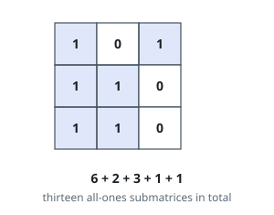
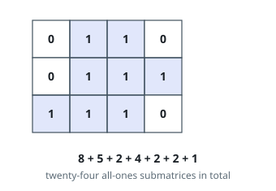

# Count Submatrices With All Ones

## Description

Given an `m x n` binary matrix `mat`, return the number of submatrices that
have all ones.

### Example 1

```text
Input: mat = [[1,0,1],[1,1,0],[1,1,0]]
Output: 13
Explanation:
There are 6 rectangles of side 1x1.
There are 2 rectangles of side 1x2.
There are 3 rectangles of side 2x1.
There is 1 rectangle of side 2x2.
There is 1 rectangle of side 3x1.
Total number of rectangles = 6 + 2 + 3 + 1 + 1 = 13.
```



### Example 2

```text
Input: mat = [[0,1,1,0],[0,1,1,1],[1,1,1,0]]
Output: 24
Explanation:
There are 8 rectangles of side 1x1.
There are 5 rectangles of side 1x2.
There are 2 rectangles of side 1x3.
There are 4 rectangles of side 2x1.
There are 2 rectangles of side 2x2.
There are 2 rectangles of side 3x1.
There is 1 rectangle of side 3x2.
Total number of rectangles = 8 + 5 + 2 + 4 + 2 + 2 + 1 = 24.
```



### Constraints

- `1 <= m, n <= 150`
- `mat[i][j]` is either `0` or `1`.

## Hints

### Hint 1

For each row i, create an array nums where: if mat[i][j] == 0 then nums[j] = 0 else nums[j] = nums[j-1] + 1.

### Hint 2

In the row i, number of rectangles between column j and k (inclusive) and ends in row i, is equal to SUM(min(nums[j, .. idx])) where idx go from j to k. Expected solution is O(n^3).
