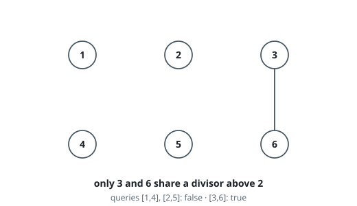
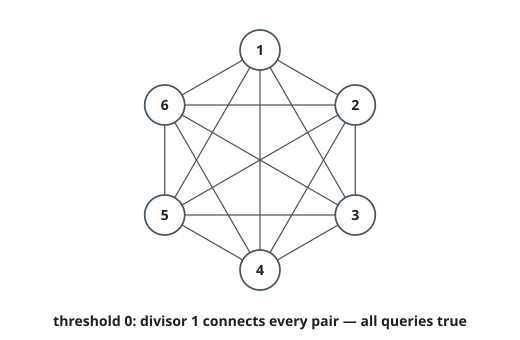
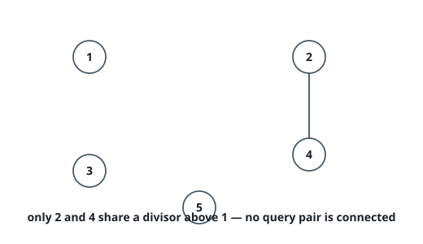

# Graph Connectivity With Threshold

## Description

We have `n` cities labeled from `1` to `n`. Two different cities with labels
`x` and `y` are directly connected by a bidirectional road if and only if `x`
and `y` share a common divisor strictly greater than some `threshold`. More
formally, cities with labels `x` and `y` have a road between them if there
exists an integer `z` such that all of the following are true:

- `x % z == 0`
- `y % z == 0`
- `z > threshold`

Given the two integers `n` and `threshold`, and an array of `queries`, you must
determine for each `queries[i] = [ai, bi]` if cities `ai` and `bi` are connected
directly or indirectly. (i.e. there is some path between them).

Return an array `answer`, where `answer.length == queries.length` and
`answer[i]` is `true` if for the `i`th query, there is a path between `ai` and
`bi`, or `answer[i]` is `false` if there is no path.

### Example 1

```text
Input: n = 6, threshold = 2, queries = [[1,4],[2,5],[3,6]]
Output: [false,false,true]
Explanation: The divisors for each number:
1:   1
2:   1, 2
3:   1, 3
4:   1, 2, 4
5:   1, 5
6:   1, 2, 3, 6
Using the underlined divisors above the threshold, only cities 3 and 6 share a
common divisor, so they are the only ones directly connected. The result of
each query:
[1,4]   1 is not connected to 4
[2,5]   2 is not connected to 5
[3,6]   3 is connected to 6 through path 3--6
```



### Example 2

```text
Input: n = 6, threshold = 0, queries = [[4,5],[3,4],[3,2],[2,6],[1,3]]
Output: [true,true,true,true,true]
Explanation: The divisors for each number are the same as the previous
example. However, since the threshold is 0, all divisors can be used. Since all
numbers share 1 as a divisor, all cities are connected.
```



### Example 3

```text
Input: n = 5, threshold = 1, queries = [[4,5],[4,5],[3,2],[2,3],[3,4]]
Output: [false,false,false,false,false]
Explanation: Only cities 2 and 4 share a common divisor 2 which is strictly
greater than the threshold 1, so they are the only ones directly connected.
Please notice that there can be multiple queries for the same pair of nodes
[x, y], and that the query [x, y] is equivalent to the query [y, x].
```



### Constraints

- `2 <= n <= 10^4`
- `0 <= threshold <= n`
- `1 <= queries.length <= 10^5`
- `queries[i].length == 2`
- `1 <= ai, bi <= n`
- `ai != bi`

## Hints

### Hint 1

How to build the graph of the cities?

### Hint 2

Connect city z (for each z > threshold) with all its multiples 2z, 3z, ...

### Hint 3

Answer the queries using a union-find data structure.
