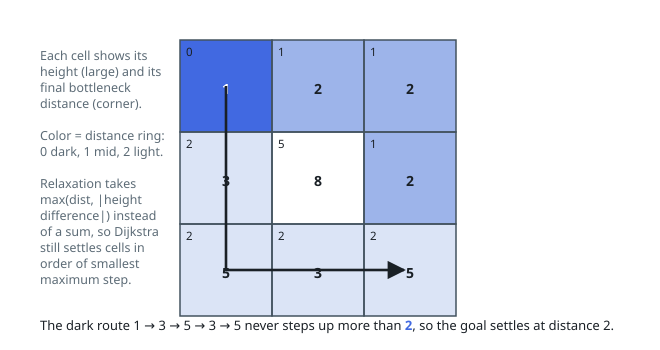

# Solutions — Path With Minimum Effort

Three routes to the same minimax answer: a bottleneck Dijkstra that grows
the running maximum, a binary search over candidate answers each checked
with a plain BFS, and a Kruskal-style union-find that reveals the answer as
the edge that first joins the two corners.

## Modified Dijkstra

A path's effort is not the sum of its steps but the maximum height difference along it, which makes this a bottleneck shortest-path problem. Dijkstra adapts directly: replace addition with `max`. The distance to a neighbor becomes `max(dist[current], |heights difference|)`, and the invariant — the popped cell with the smallest tentative effort already has its final effort — still holds because `max` is monotone and non-negative.

The priority queue starts at `(0, 0, 0)` with effort 0. Each pop checks whether it is the bottom-right cell and returns immediately, since the first time the goal is popped its effort is optimal; a stale-entry guard (`d > dist[r][c]`) skips outdated heap entries, and each of the four cardinal neighbors is relaxed only when the new bottleneck effort strictly improves its recorded value. A 1×1 grid returns 0 on the very first pop, and non-positive height differences never increase the running maximum.

Because every relaxation only lowers a cell's tentative effort and each cell re-enters the heap at most once per improving neighbor, the algorithm terminates after `O(rows × cols)` useful relaxations. This mirrors textbook Dijkstra with the edge weight replaced by the bottleneck combination rule.

**Complexity:** `O(mn log(mn))` time, `O(mn)` space, for an `m × n` grid.

## Binary Search on the Answer

Flip the question: instead of hunting for the cheapest bottleneck directly, ask whether a given effort cap is enough — is there some path from the top-left to the bottom-right that never steps between two cells more than `cap` apart? Feasibility is monotone in the cap: a path that fits under a cap still fits under any larger one, so the workable caps form a suffix `[answer, ∞)` and binary search finds its left edge.

Each probe is a plain BFS from `(0, 0)` that only crosses edges whose height difference is at most `mid`, marking cells visited so each is dequeued once. Reaching the bottom-right cell means the cap is feasible, so `hi` drops to `mid`; falling short means every cheap step is exhausted short of the goal, so `lo` rises past `mid`. The bounds start at `[0, largest adjacent height difference]` — no path can force a bigger step than that — and a 1×1 grid has no edges at all, so the upper bound stays 0 and the loop never runs.

Each probe is a linear scan of the grid (`O(mn)` with the visited marking), and only about `log(max difference)` probes are needed, since the bounds halve each time. That log factor replaces Dijkstra's `log(mn)`, and it wins whenever the height range is small relative to the grid.

**Complexity:** `O(mn log(max difference))` time — one linear BFS per binary-search step — and `O(mn)` space for the visited grid.

## Kruskal-Style Union-Find

Build every edge of the grid — one to the right neighbor and one to the down neighbor per cell, weighted by the absolute height difference, endpoints flattened to `r * cols + c` — and sort them by weight ascending. That ordering is Kruskal's skeleton, asked a different stopping question: not "is the spanning tree complete" but "do the two corners share a component yet".

Start a union-find (path compression, union by size) over the `m * n` singletons and scan the edges lightest first, skipping pairs whose endpoints are already connected and unioning the rest. The moment `find(0) == find(rows * cols - 1)`, the current edge's weight is the answer: every path between the corners must include an edge of at least that weight (all strictly lighter edges were already offered and did not connect them), while the processed edges themselves describe a route whose heaviest step is at most that weight — the minimax value. A 1×1 grid starts connected and answers 0 before any edge is considered.

The sort does all the heavy lifting and the unions are nearly free.

**Complexity:** `O(E log E)` time for the sort, where `E = 2mn - m - n` grid edges, plus near-inverse-Ackermann union-find operations; `O(mn)` space for the edge list and the two arrays.
