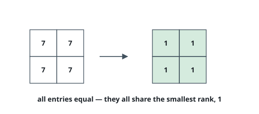
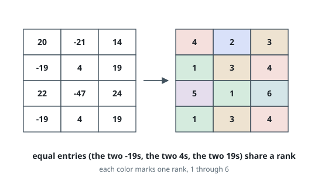

# Rank Transform of a Matrix

## Description

Given an `m x n` matrix, return a new matrix `answer` where
`answer[row][col]` is the rank of `matrix[row][col]`.

The rank is an integer that represents how large an element is compared to
other elements. It is calculated using the following rules:

- The rank is an integer starting from `1`.
- If two elements `p` and `q` are in the same row or column, then:
    - If `p < q` then `rank(p) < rank(q)`
    - If `p == q` then `rank(p) == rank(q)`
    - If `p > q` then `rank(p) > rank(q)`
- The rank should be as small as possible.

The test cases are generated so that `answer` is unique under the given rules.

### Example 1

```text
Input: matrix = [[1,2],[3,4]]
Output: [[1,2],[2,3]]
Explanation:
The rank of matrix[0][0] is 1 because it is the smallest integer in its row and column.
The rank of matrix[0][1] is 2 because matrix[0][1] > matrix[0][0] and matrix[0][0] is rank 1.
The rank of matrix[1][0] is 2 because matrix[1][0] > matrix[0][0] and matrix[0][0] is rank 1.
The rank of matrix[1][1] is 3 because matrix[1][1] > matrix[0][1], matrix[1][1] > matrix[1][0], and both matrix[0][1] and matrix[1][0] are rank 2.
```

![The matrix [[1,2],[3,4]] transformed into ranks [[1,2],[2,3]], one color per rank.](figures/example-1.svg)

### Example 2

```text
Input: matrix = [[7,7],[7,7]]
Output: [[1,1],[1,1]]
```



### Example 3

```text
Input: matrix = [[20,-21,14],[-19,4,19],[22,-47,24],[-19,4,19]]
Output: [[4,2,3],[1,3,4],[5,1,6],[1,3,4]]
```



### Constraints

- `m == matrix.length`
- `n == matrix[i].length`
- `1 <= m, n <= 500`
- `-10⁹ <= matrix[row][col] <= 10⁹`

## Hints

### Hint 1

Sort the cells by value and process them in increasing order.

### Hint 2

The rank of a cell is the maximum rank in its row and column plus one.

### Hint 3

Handle the equal cells by treating them as components using a union-find data structure.
