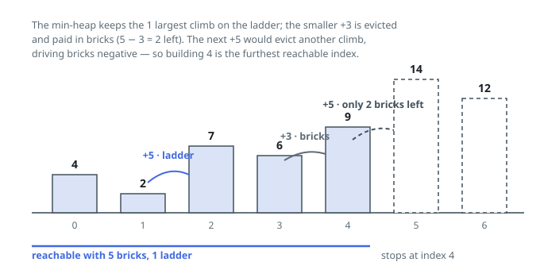

# Solutions — Furthest Building You Can Reach

## Greedy Ladder Reservation

Every uphill step (positive climb) must be paid for with either one ladder or that many bricks, and we want to reach as far as possible. The key exchange argument: if we must regret a choice, it is always better to have spent a ladder on the largest climb so far and bricks on the smallest ones, because a ladder saves exactly the brick count of the climb it covers.

Maintain a min-heap of the climbs currently covered by ladders. For each positive climb, push it; as soon as the heap holds more than `ladders` climbs, the smallest one is evicted and paid with bricks instead. When bricks first go negative, the move from building `i` to `i + 1` is unaffordable under the best possible assignment, so `i` is the answer. If the loop finishes, every climb was covered and the last index is reachable.

This online greedy never needs to undo earlier decisions: at each prefix it keeps exactly the `ladders` largest climbs on ladders and the rest on bricks, which minimizes brick consumption for that prefix and therefore maximizes how far the budget stretches. Downhill and flat steps are skipped for free, `ladders = 0` simply evicts every climb immediately, and the heap never exceeds `ladders + 1` entries.

**Complexity:** `O(n log L)` time, `O(L)` space, where `L` is the number of ladders.
