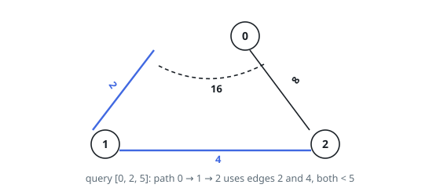
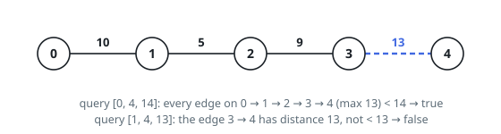

# Checking Existence of Edge Length Limited Paths

## Description

An undirected graph of `n` nodes is defined by `edgeList`, where
`edgeList[i] = [u_i, v_i, dis_i]` denotes an edge between nodes `u_i` and
`v_i` with distance `dis_i`. Note that there may be multiple edges between
two nodes.

Given an array `queries`, where `queries[j] = [p_j, q_j, limit_j]`, your
task is to determine for each `queries[j]` whether there is a path between
`p_j` and `q_j` such that each edge on the path has a distance strictly less
than `limit_j`.

Return a boolean array `answer`, where `answer.length == queries.length` and
the `j`th value of `answer` is `true` if there is a path for `queries[j]`,
and `false` otherwise.

### Example 1

```text
Input: n = 3, edgeList = [[0,1,2],[1,2,4],[2,0,8],[1,0,16]], queries = [[0,1,2],[0,2,5]]
Output: [false,true]
Explanation: Note that there are two overlapping edges between 0 and 1 with
distances 2 and 16.
For the first query, between 0 and 1 there is no path where each distance
is less than 2, thus we return false for this query.
For the second query, there is a path (0 -> 1 -> 2) of two edges with
distances less than 5, thus we return true for this query.
```



### Example 2

```text
Input: n = 5, edgeList = [[0,1,10],[1,2,5],[2,3,9],[3,4,13]], queries = [[0,4,14],[1,4,13]]
Output: [true,false]
```



### Constraints

- `2 <= n <= 10^5`
- `1 <= edgeList.length, queries.length <= 10^5`
- `edgeList[i].length == 3`
- `queries[j].length == 3`
- `0 <= u_i, v_i, p_j, q_j <= n - 1`
- `u_i != v_i`
- `p_j != q_j`
- `1 <= dis_i, limit_j <= 10^9`
- There may be multiple edges between two nodes.

## Hints

### Hint 1

All the queries are given in advance. Is there a way you can reorder the queries to avoid repeated computations?

### Hint 2

Sort the edges by weight and the queries by limit, then process queries in increasing limit order while unioning all edges with weight strictly below the limit.

### Hint 3

With union-find, each query reduces to checking whether its endpoints share a root.
