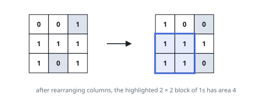
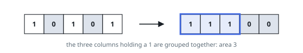

# Largest Submatrix With Rearrangements

## Description

You are given a binary matrix `matrix` of size `m x n`, and you are allowed to
rearrange the columns of the matrix in any order.

Return the area of the largest submatrix within `matrix` where every element of
the submatrix is `1` after reordering the columns optimally.

### Example 1

```text
Input: matrix = [[0,0,1],[1,1,1],[1,0,1]]
Output: 4
Explanation: You can rearrange the columns as shown above.
The largest submatrix of 1s, in bold, has an area of 4.
```



### Example 2

```text
Input: matrix = [[1,0,1,0,1]]
Output: 3
Explanation: You can rearrange the columns as shown above.
The largest submatrix of 1s, in bold, has an area of 3.
```



### Example 3

```text
Input: matrix = [[1,1,0],[1,0,1]]
Output: 2
Explanation: Notice that you must rearrange entire columns, and there is no
way to make a submatrix of 1s larger than an area of 2.
```

### Constraints

- `m == matrix.length`
- `n == matrix[i].length`
- `1 <= m * n <= 10⁵`
- `matrix[i][j]` is either `0` or `1`.

## Hints

### Hint 1

For each column, compute the number of consecutive 1s ending at each row (reset to 0 whenever a 0 appears).

### Hint 2

For each row, sort its cumulative heights in non-increasing order; the best submatrix ending at that row has height h and width (number of columns with height >= h).
