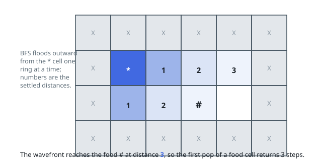

# Solutions — Shortest Path to Get Food

## Breadth-First Search

Every move between adjacent cells costs exactly one step, so the grid is an unweighted graph and breadth-first search from the single start cell computes true shortest distances: the first time any cell is reached, it is reached by a shortest path. Food cells are targets, not sources, so a plain single-source BFS from the `'*'` cell suffices — with multiple food cells, the first one dequeued is the nearest one.

The code scans the grid once to locate the `'*'` cell, then runs BFS with a `dist` matrix initialized to `-1` that doubles as the visited marker. Each dequeued cell is checked for being food (`'#'`), in which case its recorded distance is returned immediately; otherwise its four neighbors are enqueued if they are inside the grid, not an obstacle `'X'`, and not yet visited. Marking `dist` at enqueue time rather than at dequeue time prevents the same cell from entering the queue twice.

If the queue drains without ever dequeuing a food cell, no path exists and the function returns `-1`, which also covers the case of food completely walled off by obstacles. The start cell itself is never food, and obstacles are excluded from expansion but not from the initial scan.

**Complexity:** `O(mn)` time, `O(mn)` space.
