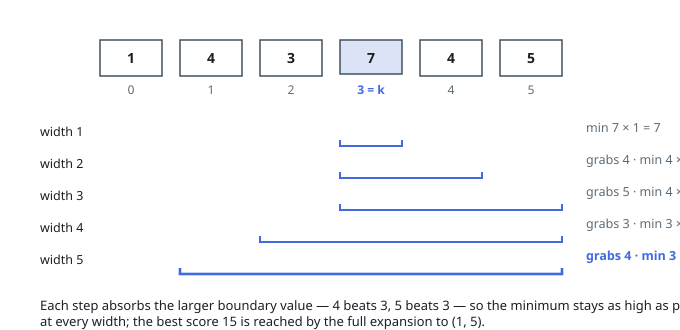

# Solutions — Maximum Score of a Good Subarray

## Two-Pointer Expansion from k

Every good subarray contains index `k`, so all candidates are intervals `[lo, hi]` that can be grown outward from the starting point `(k, k)` — the search is over how far left and right to extend. The score of an interval is its running minimum times its width, and expanding can only widen the interval while possibly lowering the minimum, so each intermediate interval on any expansion path is itself a candidate worth scoring.

The algorithm expands one cell at a time, always taking the larger of the two available boundary elements `nums[lo - 1]` and `nums[hi + 1]` (with forced moves when one side hits the array edge). The exchange argument for this greed: suppose the wider interval must eventually include both boundary candidates; whichever is taken first, the running minimum ends up lowered by the smaller of the two anyway, so deferring the smaller element — i.e. grabbing the larger one now — can only keep the minimum higher at the current width and at every width in between. Consequently, at each width `w`, the interval built by this rule has the maximum possible minimum among all length-`w` intervals containing `k`, and scoring every step covers all widths.

Concretely, the code maintains `cur_min` over the current interval, updates it with each newly absorbed candidate element, and records the best `cur_min * (hi - lo + 1)`; the loop runs until both pointers reach the array ends, guaranteeing every width from 1 to `n` was visited. The initial single-cell interval contributes `nums[k] * 1`, which also handles `n == 1` where the loop body never executes.

**Complexity:** `O(n)` time, `O(1)` space.
