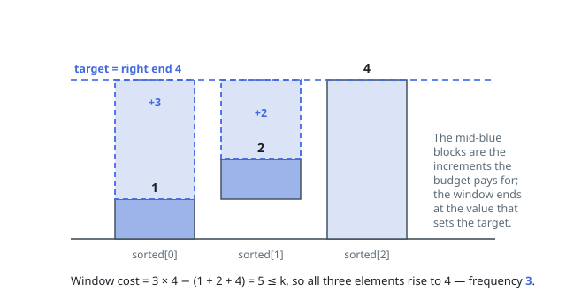

# Solutions — Frequency of the Most Frequent Element

## Sliding window on the sorted array

Operations only ever increase elements, so an optimal final group of equal values `v` consists of elements that were all at most `v` and were raised up to it. Once the array is sorted, such a group is a contiguous window ending at the element that defines `v` — the window's rightmost element is the target because raising anything above the current maximum buys nothing. The cost of a window `[left, right]` is `(right - left + 1) * nums[right] - window_sum`, the total number of increments needed to pull every member up to the right end.

The code expands `right` one step at a time, adding each new element to the running window sum, and shrinks from the left while the cost exceeds `k`. The window length never needs to be revisited: if a window ending at `right` is infeasible at its current left end, dropping the smallest element is the only repair, and once a window of some length is affordable every shorter window is too. The best length seen at each step is the answer.

Two edge behaviors fall out for free: the answer is at least 1 because a single element is always a valid window, and if `k` covers the entire array the window simply grows to `n` and stops shrinking.

**Complexity:** `O(n log n)` time, `O(n)` space.
