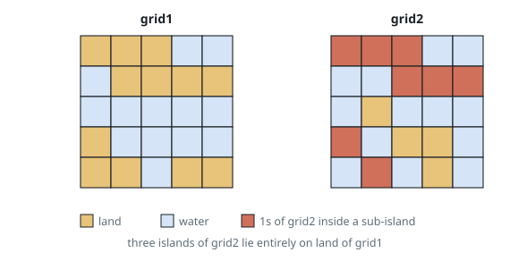
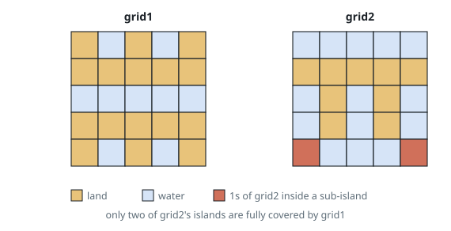

# Count Sub Islands

## Description

You are given two `m x n` binary matrices `grid1` and `grid2` containing only
`0`'s (representing water) and `1`'s (representing land). An island is a group
of `1`'s connected 4-directionally (horizontal or vertical). Any cells outside
of the grid are considered water cells.

An island in `grid2` is considered a sub-island if there is an island in
`grid1` that contains all the cells that make up this island in `grid2`.

Return the number of islands in `grid2` that are considered sub-islands.

### Example 1

```text
Input: grid1 = [[1,1,1,0,0],[0,1,1,1,1],[0,0,0,0,0],[1,0,0,0,0],[1,1,0,1,1]], grid2 = [[1,1,1,0,0],[0,0,1,1,1],[0,1,0,0,0],[1,0,1,1,0],[0,1,0,1,0]]
Output: 3
Explanation: The 1s colored red in grid2 are those considered to be part of a
sub-island. There are three sub-islands.
```



### Example 2

```text
Input: grid1 = [[1,0,1,0,1],[1,1,1,1,1],[0,0,0,0,0],[1,1,1,1,1],[1,0,1,0,1]], grid2 = [[0,0,0,0,0],[1,1,1,1,1],[0,1,0,1,0],[0,1,0,1,0],[1,0,0,0,1]]
Output: 2
Explanation: The 1s colored red in grid2 are those considered to be part of a
sub-island. There are two sub-islands.
```



### Constraints

- `m == grid1.length == grid2.length`
- `n == grid1[i].length == grid2[i].length`
- `1 <= m, n <= 500`
- `grid1[i][j]` and `grid2[i][j]` are either `0` or `1`.

## Hints

### Hint 1

Use flood fill to iterate over the islands of grid2.

### Hint 2

An island in grid2 is a sub-island exactly when every one of its cells is also land in grid1, since those cells are then connected in grid1 too.
