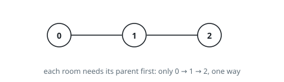
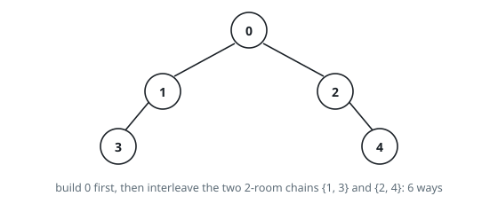

# Count Ways to Build Rooms in an Ant Colony

## Description

You are an ant tasked with adding `n` new rooms numbered `0` to `n - 1` to
your colony. You are given the expansion plan as a 0-indexed integer array of
length `n`, `prevRoom`, where `prevRoom[i]` indicates that you must build room
`prevRoom[i]` before building room `i`, and these two rooms must be connected
directly. Room `0` is already built, so `prevRoom[0] = -1`. The expansion plan
is given such that once all the rooms are built, every room will be reachable
from room `0`.

You can only build one room at a time, and you can travel freely between rooms
you have already built only if they are connected. You can choose to build any
room as long as its previous room is already built.

Return the number of different orders you can build all the rooms in. Since
the answer may be large, return it modulo `10⁹ + 7`.

### Example 1

```text
Input: prevRoom = [-1,0,1]
Output: 1
Explanation: There is only one way to build the additional rooms: 0 → 1 → 2
```



### Example 2

```text
Input: prevRoom = [-1,0,0,1,2]
Output: 6
Explanation:
The 6 ways are:
0 → 1 → 3 → 2 → 4
0 → 2 → 4 → 1 → 3
0 → 1 → 2 → 3 → 4
0 → 1 → 2 → 4 → 3
0 → 2 → 1 → 3 → 4
0 → 2 → 1 → 4 → 3
```



### Constraints

- `n == prevRoom.length`
- `2 <= n <= 10⁵`
- `prevRoom[0] == -1`
- `0 <= prevRoom[i] < n` for all `1 <= i < n`
- Every room is reachable from room `0` once all the rooms are built.

## Hints

### Hint 1

Use dynamic programming on the tree rooted at room 0.

### Hint 2

Let dp[i] be the number of ways to solve the problem for the subtree of node i.

### Hint 3

dp[i] equals the number of ways to interleave the children's subtree orderings, times the product of their dp values, using multinomial coefficients.
