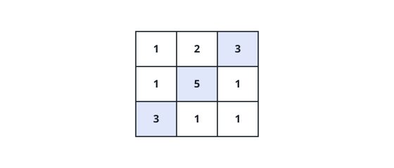
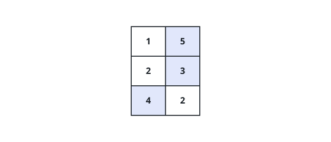

# Maximum Number of Points with Cost

## Description

You are given an `m x n` integer matrix `points` (0-indexed).
Starting with `0` points, you want to maximize the number of points you can
get from the matrix.

To gain points, you must pick one cell in each row. Picking the cell at
coordinates `(r, c)` will add `points[r][c]` to your score.

However, you will lose points if you pick a cell too far from the cell that
you picked in the previous row. For every two adjacent rows `r` and `r + 1`
(where `0 <= r < m - 1`), picking cells at coordinates `(r, c1)` and
`(r + 1, c2)` will subtract `abs(c1 - c2)` from your score.

Return the maximum number of points you can achieve.

`abs(x)` is defined as:

- `x` for `x >= 0`.
- `-x` for `x < 0`.

### Example 1

```text
Input: points = [[1,2,3],[1,5,1],[3,1,1]]
Output: 9
Explanation:
The blue cells denote the optimal cells to pick, which have coordinates (0, 2), (1, 1), and (2, 0).
You add 3 + 5 + 3 = 11 to your score.
However, you must subtract abs(2 - 1) + abs(1 - 0) = 2 from your score.
Your final score is 11 - 2 = 9.
```



### Example 2

```text
Input: points = [[1,5],[2,3],[4,2]]
Output: 11
Explanation:
The blue cells denote the optimal cells to pick, which have coordinates (0, 1), (1, 1), and (2, 0).
You add 5 + 3 + 4 = 12 to your score.
However, you must subtract abs(1 - 1) + abs(1 - 0) = 1 from your score.
Your final score is 12 - 1 = 11.
```



### Constraints

- `m == points.length`
- `n == points[r].length`
- `1 <= m, n <= 10^5`
- `1 <= m * n <= 10^5`
- `0 <= points[r][c] <= 10^5`

## Hints

### Hint 1

Use dynamic programming: let dp[i][j] be the maximum number of points you can have when the most recent cell you picked is points[i][j].

### Hint 2

Transitioning each row naively costs O(n^2); a left-to-right and a right-to-left running maximum reduce each row transition to O(n).
