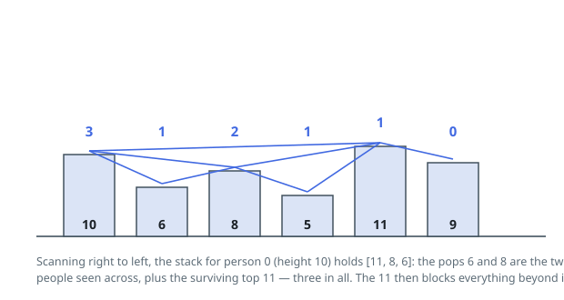

# Solutions — Number of Visible People in a Queue

## Monotonic Stack from the Right

Person `i` sees person `j > i` when everyone strictly between them is shorter than both endpoints. Scanning from the right with a stack of heights kept increasing from top to bottom gives an exact account of who is visible: the stack holds, for the suffix processed so far, exactly those people who are visible to someone shorter arriving from the left — each was a right-to-left height record until displaced. When `heights[i]` arrives, every stack entry shorter than it is popped and counted, because each of those people has only shorter people between themselves and `i`; if the stack is then non-empty, its top is the first person to the right of `i` taller than `i`, whom `i` can see across all the popped people; everyone beyond that top is blocked by it.

After counting, `heights[i]` is pushed so that people further left can see it in turn. The popped entries are legitimately discarded: a taller person to the left can never see anyone shorter than `heights[i]` beyond `i`, so `i` shadows them. All heights are distinct, which is why strict `<` in the pop condition is enough and no tie handling is needed.

Each index is pushed once and popped at most once, so despite the nested `while` inside the `for`, the total work is linear. The rightmost person sees no one (empty stack, zero pops), and a monotonically decreasing queue makes everyone see exactly their immediate neighbor, both falling out of the same mechanism.

**Complexity:** `O(n)` time, `O(n)` space.
