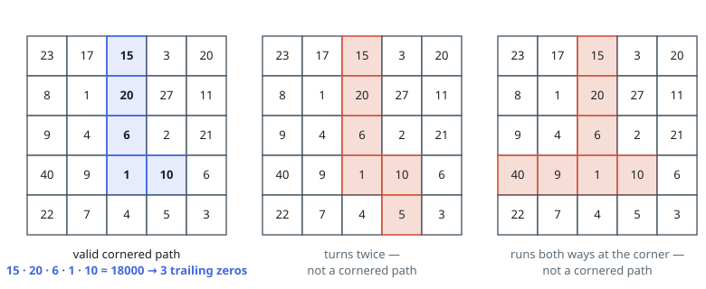
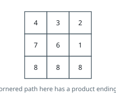

# Maximum Trailing Zeros in a Cornered Path

## Description

You are given a 2D integer array `grid` of size `m x n`, where each cell contains a positive integer.

A cornered path is defined as a set of adjacent cells with at most one turn. More specifically, the path should exclusively move either horizontally or vertically up to the turn (if there is one), without returning to a previously visited cell. After the turn, the path will then move exclusively in the alternate direction: move vertically if it moved horizontally, and vice versa, also without returning to a previously visited cell.

The product of a path is defined as the product of all the values in the path.

Return the maximum number of trailing zeros in the product of a cornered path found in `grid`.

Note:

- Horizontal movement means moving in either the left or right direction.
- Vertical movement means moving in either the up or down direction.

### Example 1

```text
Input: grid = [[23,17,15,3,20],[8,1,20,27,11],[9,4,6,2,21],[40,9,1,10,6],[22,7,4,5,3]]
Output: 3
Explanation: The grid on the left shows a valid cornered path.
It has a product of 15 * 20 * 6 * 1 * 10 = 18000 which has 3 trailing zeros.
It can be shown that this is the maximum trailing zeros in the product of a cornered path.
```



### Example 2

```text
Input: grid = [[4,3,2],[7,6,1],[8,8,8]]
Output: 0
Explanation: The grid is shown in the figure above.
There are no cornered paths in the grid that result in a product with a trailing zero.
```



### Constraints

- `m == grid.length`
- `n == grid[i].length`
- `1 <= m, n <= 10^5`
- `1 <= m * n <= 10^5`
- `1 <= grid[i][j] <= 1000`

## Hints

### Hint 1

What actually tells us the trailing zeros of the product of a path?

### Hint 2

It is the sum of the exponents of 2 and sum of the exponents of 5 of the prime factorizations of the numbers on that path. The smaller of the two is the answer for that path.

### Hint 3

We can then treat each cell as the elbow point and calculate the largest minimum (sum of 2 exponents, sum of 5 exponents) from the combination of top-left, top-right, bottom-left and bottom-right.

### Hint 4

To do this efficiently, we should use the prefix sum technique.
