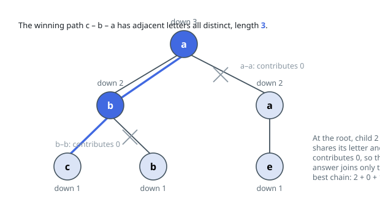

# Solutions — Longest Path With Different Adjacent Characters

## Postorder tree DP on the top two chains

For every node `u`, define `down[u]` as the length of the longest valid chain that starts at `u` and descends into its subtree. Any valid path in the tree has a highest node through which it passes, where it descends into two different child subtrees, so the global answer is the maximum over all `u` of (best child chain + second-best child chain + 1). This classic tree shape means one postorder pass computing `down` suffices — no path needs to be traced explicitly.

A child's chain can only be welded through `u` when the characters differ: a child `v` contributes `down[v]` if `s[v] != s[u]` and `0` otherwise, since the edge `u—v` would join two equal characters. Each node tracks the largest and second-largest contributions among its children (updating `first`/`second` as a two-element running maximum), sets `down[u] = first + 1`, and folds `first + second + 1` into the answer. The `+1`s count `u` itself, and `best` initialized to 1 covers the single-node tree where `n = 1`.

At `n = 10^5`, recursion risks blowing the stack, so the code first derives the children lists from `parent`, then produces a preorder with an explicit stack — which guarantees parents appear before children — and processes that order in reverse to get a valid postorder evaluation sequence. Every node and edge is touched a constant number of times.

**Complexity:** `O(n)` time, `O(n)` space.
