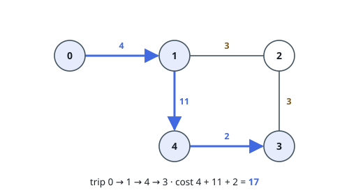
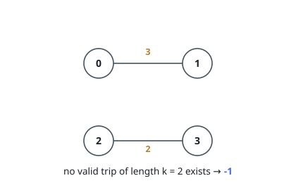

# Maximum Cost of Trip With K Highways

## Description

A series of highways connect `n` cities numbered from `0` to `n - 1`. You are
given a 2D integer array `highways` where `highways[i] = [city1_i, city2_i,
toll_i]` indicates that there is a highway that connects `city1_i` and
`city2_i`, allowing a car to go from `city1_i` to `city2_i` and vice versa for
a cost of `toll_i`.

You are also given an integer `k`. You are going on a trip that crosses
exactly `k` highways. You may start at any city, but you may only visit each
city at most once during your trip.

Return the maximum cost of your trip. If there is no trip that meets the
requirements, return `-1`.

### Example 1

```text
Input: n = 5, highways = [[0,1,4],[2,1,3],[1,4,11],[3,2,3],[3,4,2]], k = 3
Output: 17
Explanation: One possible trip is to go from 0 -> 1 -> 4 -> 3. The cost of
this trip is 4 + 11 + 2 = 17. Another possible trip is to go from
4 -> 1 -> 2 -> 3. The cost of this trip is 11 + 3 + 3 = 17. It can be proven
that 17 is the maximum possible cost of any valid trip.

Note that the trip 4 -> 1 -> 0 -> 1 is not allowed because you visit the
city 1 twice.
```



### Example 2

```text
Input: n = 4, highways = [[0,1,3],[2,3,2]], k = 2
Output: -1
Explanation: There are no valid trips of length 2, so return -1.
```



### Constraints

- `2 <= n <= 15`
- `1 <= highways.length <= 50`
- `highways[i].length == 3`
- `0 <= city1_i, city2_i <= n - 1`
- `city1_i != city2_i`
- `0 <= toll_i <= 100`
- `1 <= k <= 50`
- There are no duplicate highways.

## Hints

### Hint 1

The same partial path can be reached in many ways; how far you can extend it depends only on the set of cities already visited and the city you are currently at.

### Hint 2

Store the visited cities as a bitmask and the current city, and use dynamic programming over (mask, last city) states.

### Hint 3

A trip that crosses exactly k highways visits exactly k + 1 distinct cities, so if k + 1 > n the answer is -1.
