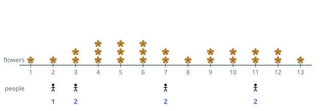
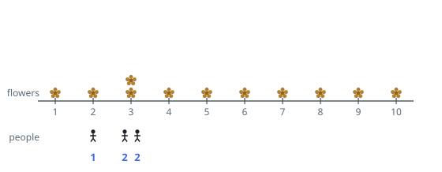

# Number of Flowers in Full Bloom

## Description

You are given a 0-indexed 2D integer array `flowers`, where
`flowers[i] = [start_i, end_i]` means the `i`th flower will be in full bloom
from `start_i` to `end_i` (inclusive). You are also given a 0-indexed integer
array `people` of size `n`, where `people[i]` is the time that the `i`th
person will arrive to see the flowers.

Return an integer array `answer` of size `n`, where `answer[i]` is the number
of flowers that are in full bloom when the `i`th person arrives.

### Example 1

```text
Input: flowers = [[1,6],[3,7],[9,12],[4,13]], people = [2,3,7,11]
Output: [1,2,2,2]
Explanation: For each person, we return the number of flowers in full bloom during their arrival.
```



### Example 2

```text
Input: flowers = [[1,10],[3,3]], people = [3,3,2]
Output: [2,2,1]
Explanation: For each person, we return the number of flowers in full bloom during their arrival.
```



### Constraints

- `1 <= flowers.length <= 5 * 10^4`
- `flowers[i].length == 2`
- `1 <= start_i <= end_i <= 10^9`
- `1 <= people.length <= 5 * 10^4`
- `1 <= people[i] <= 10^9`

## Hints

### Hint 1

For any time t, the number of flowers blooming equals the number of flowers that have started blooming minus the number that have already stopped.

### Hint 2

Store the starting times in sorted order and binary search to count how many flowers have started by time t.

### Hint 3

Do the same with the ending times to count how many flowers have already ended before t — note a flower ending exactly at t is still blooming.
