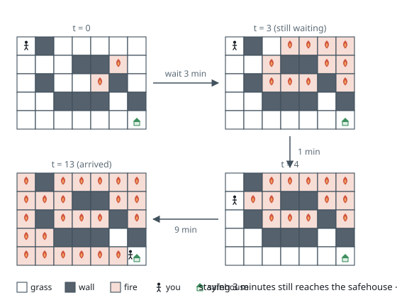
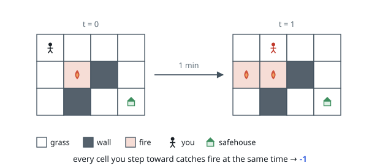
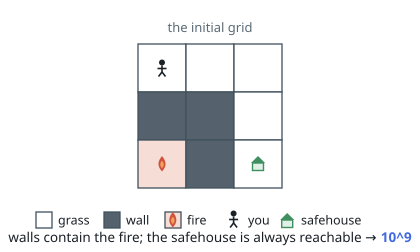

# Escape the Spreading Fire

## Description

You are given a 0-indexed 2D integer array `grid` of size `m x n` which represents a field. Each cell has one of three values:

- `0` represents grass,
- `1` represents fire,
- `2` represents a wall that you and fire cannot pass through.

You are situated in the top-left cell, `(0, 0)`, and you want to travel to the safehouse at the bottom-right cell, `(m - 1, n - 1)`. Every minute, you may move to an adjacent grass cell. After your move, every fire cell will spread to all adjacent cells that are not walls.

Return the maximum number of minutes that you can stay in your initial position before moving while still safely reaching the safehouse. If this is impossible, return `-1`. If you can always reach the safehouse regardless of the minutes stayed, return `10^9`.

Note that even if the fire spreads to the safehouse immediately after you have reached it, it will be counted as safely reaching the safehouse.

A cell is adjacent to another cell if the former is directly north, east, south, or west of the latter (i.e., their sides are touching).

### Example 1

```text
Input: grid = [[0,2,0,0,0,0,0],[0,0,0,2,2,1,0],[0,2,0,0,1,2,0],[0,0,2,2,2,0,2],[0,0,0,0,0,0,0]]
Output: 3
Explanation: The figure above shows the scenario where you stay in the initial position for 3 minutes.
You will still be able to safely reach the safehouse.
Staying for more than 3 minutes will not allow you to safely reach the safehouse.
```



### Example 2

```text
Input: grid = [[0,0,0,0],[0,1,2,0],[0,2,0,0]]
Output: -1
Explanation: The figure above shows the scenario where you immediately move towards the safehouse.
Fire will spread to any cell you move towards and it is impossible to safely reach the safehouse.
Thus, -1 is returned.
```



### Example 3

```text
Input: grid = [[0,0,0],[2,2,0],[1,2,0]]
Output: 1000000000
Explanation: The figure above shows the initial grid.
Notice that the fire is contained by walls and you will always be able to safely reach the safehouse.
Thus, 10^9 is returned.
```



### Constraints

- `m == grid.length`
- `n == grid[i].length`
- `2 <= m, n <= 300`
- `4 <= m * n <= 2 * 10^4`
- `grid[i][j]` is either `0`, `1`, or `2`.
- `grid[0][0] == grid[m - 1][n - 1] == 0`

## Hints

### Hint 1

For some tile (x, y), how can we determine when, if ever, the fire will reach it?

### Hint 2

We can use multi-source BFS to find the earliest time the fire will reach each cell.

### Hint 3

Then, starting with a given t minutes of staying in the initial position, we can check if there is a safe path to the safehouse using the obtained information about the fire.

### Hint 4

We can use binary search to efficiently find the maximum t that allows us to reach the safehouse.
