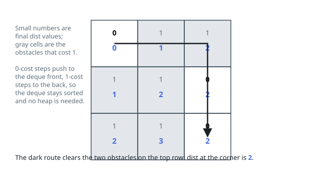

# Solutions — Minimum Obstacle Removal to Reach Corner

## 0-1 BFS with a deque

Model the grid as a graph whose nodes are cells, with an edge into each orthogonal neighbour costing `grid[neighbour]` — 1 if you must clear an obstacle to step there, 0 otherwise. The minimum number of obstacles removed is then exactly the shortest path cost from `(0, 0)` to `(m-1, n-1)` under these weights, and since every weight is 0 or 1, Dijkstra collapses into 0-1 BFS: relaxations of cost 0 push to the _front_ of a deque and relaxations of cost 1 push to the _back_, which keeps the deque's distances non-decreasing so a popped node is always finalized — no priority queue needed.

The code keeps a `dist` grid initialized to infinity with `dist[0][0] = 0` and processes cells off the front. For each neighbour, the candidate cost is `d + grid[ni][nj]`; it is only recorded, and enqueued, when it strictly improves the neighbour's distance, which both prunes stale entries and lets a cell be re-expanded at most a constant number of times (once per improving relaxation — at most twice, since its distance can only drop from infinity to 1 and then possibly to 0). Walls don't exist in this problem; every in-bounds neighbour is traversable at a cost.

Because each cell is expanded with each of its four edges a bounded number of times, the traversal is linear in the grid size. The answer is read straight from `dist[m-1][n-1]`, which stays infinite only if the corner is unreachable — impossible here since the grid is all-passable, but the invariant still holds by construction.

**Complexity:** `O(mn)` time, `O(mn)` space.
