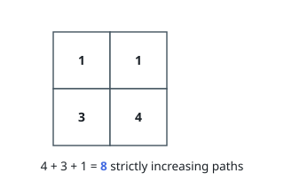

# Number of Increasing Paths in a Grid

## Description

You are given an `m x n` integer matrix `grid`, where you can move from a cell
to any adjacent cell in all 4 directions.

Return the number of strictly increasing paths in the grid such that you can
start from any cell and end at any cell. Since the answer may be very large,
return it modulo `10^9 + 7`.

Two paths are considered different if they do not have exactly the same
sequence of visited cells.

### Example 1

```text
Input: grid = [[1,1],[3,4]]
Output: 8
Explanation: The strictly increasing paths are:
- Paths with length 1: [1], [1], [3], [4].
- Paths with length 2: [1 -> 3], [1 -> 4], [3 -> 4].
- Paths with length 3: [1 -> 3 -> 4].
The total number of paths is 4 + 3 + 1 = 8.
```



### Example 2

```text
Input: grid = [[1],[2]]
Output: 3
Explanation: The strictly increasing paths are:
- Paths with length 1: [1], [2].
- Paths with length 2: [1 -> 2].
The total number of paths is 2 + 1 = 3.
```

### Constraints

- `m == grid.length`
- `n == grid[i].length`
- `1 <= m, n <= 1000`
- `1 <= m * n <= 10^5`
- `1 <= grid[i][j] <= 10^5`

## Hints

### Hint 1

How can you calculate the number of increasing paths that start from a cell (i, j)? Think about dynamic programming.

### Hint 2

Define f(i, j) as the number of increasing paths starting from cell (i, j). Try to find how f(i, j) is related to each of f(i, j+1), f(i, j-1), f(i+1, j) and f(i-1, j).
