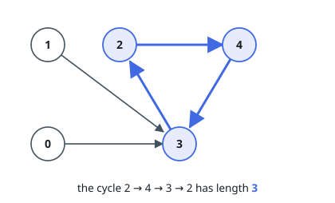
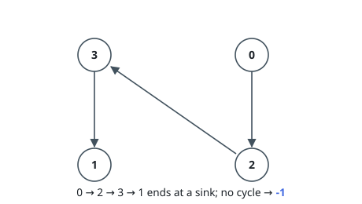

# Longest Cycle in a Graph

## Description

You are given a directed graph of `n` nodes numbered from `0` to `n - 1`,
where each node has at most one outgoing edge.

The graph is represented with a given 0-indexed array `edges` of size `n`,
indicating that there is a directed edge from node `i` to node `edges[i]`. If
there is no outgoing edge from node `i`, then `edges[i] == -1`.

Return the length of the longest cycle in the graph. If no cycle exists,
return `-1`.

A cycle is a path that starts and ends at the same node.

### Example 1

```text
Input: edges = [3,3,4,2,3]
Output: 3
Explanation: The longest cycle in the graph is the cycle: 2 -> 4 -> 3 -> 2.
The length of this cycle is 3, so 3 is returned.
```



### Example 2

```text
Input: edges = [2,-1,3,1]
Output: -1
Explanation: There are no cycles in this graph.
```



### Constraints

- `n == edges.length`
- `2 <= n <= 10^5`
- `-1 <= edges[i] < n`
- `edges[i] != i`

## Hints

### Hint 1

How many cycles can each node at most be part of?

### Hint 2

Each node can be part of at most one cycle. Start from each node and find the cycle that it is part of if there is any. Save the already visited nodes to not repeat visiting the same cycle multiple times.
