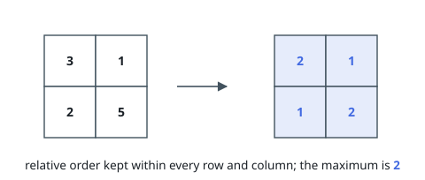

# Minimize Maximum Value in a Grid

## Description

You are given an `m x n` integer matrix `grid` containing distinct positive
integers.

You have to replace each integer in the matrix with a positive integer
satisfying the following conditions:

- The relative order of every two elements that are in the same row or column
  should stay the same after the replacements.
- The maximum number in the matrix after the replacements should be as small
  as possible.

The relative order stays the same if for all pairs of elements in the original
matrix such that `grid[r1][c1] > grid[r2][c2]` where either `r1 == r2` or
`c1 == c2`, then it must be true that `grid[r1][c1] > grid[r2][c2]` after the
replacements.

For example, if `grid = [[2, 4, 5], [7, 3, 9]]` then a good replacement could
be either `grid = [[1, 2, 3], [2, 1, 4]]` or `grid = [[1, 2, 3], [3, 1, 4]]`.

Return the resulting matrix. If there are multiple answers, this judge expects
the canonical one: fill the cells in increasing order of their original values
(since all values are distinct this order is unambiguous), assigning each cell
the smallest positive integer strictly greater than every value already placed
in its row and its column.

### Example 1

```text
Input: grid = [[3,1],[2,5]]
Output: [[2,1],[1,2]]
Explanation: A valid replacement is shown above.
The maximum number in the matrix is 2. It can be shown that no smaller value can be obtained.
```



### Example 2

```text
Input: grid = [[10]]
Output: [[1]]
Explanation: We replace the only number in the matrix with 1.
```

### Constraints

- `m == grid.length`
- `n == grid[i].length`
- `1 <= m, n <= 1000`
- `1 <= m * n <= 10^5`
- `1 <= grid[i][j] <= 10^9`
- `grid` consists of distinct integers.

## Hints

### Hint 1

Can you think of which element in the grid you should replace first?

### Hint 2

Replace the elements in the matrix from the smallest number to the largest. Replace each element with the smallest possible number so far.
