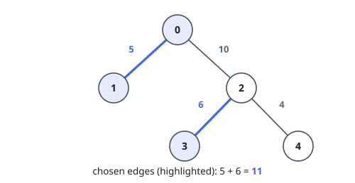
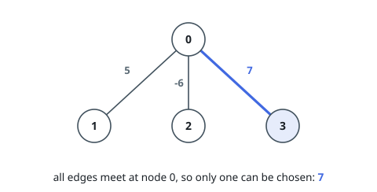

# Choose Edges to Maximize Score in a Tree

## Description

You are given a weighted tree consisting of `n` nodes numbered from `0` to
`n - 1`.

The tree is rooted at node `0` and represented with a 2D array `edges` of size
`n` where `edges[i] = [par_i, weight_i]` indicates that node `par_i` is the
parent of node `i`, and the edge between them has a weight equal to
`weight_i`. Since the root does not have a parent, you have
`edges[0] = [-1, -1]`.

Choose some edges from the tree such that no two chosen edges are adjacent and
the sum of the weights of the chosen edges is maximized.

Return the maximum sum of the chosen edges.

Note:

- You are allowed to not choose any edges in the tree; the sum of weights in
  this case will be `0`.
- Two edges `Edge1` and `Edge2` in the tree are adjacent if they have a common
  node. In other words, they are adjacent if `Edge1` connects nodes `a` and
  `b` and `Edge2` connects nodes `b` and `c`.

### Example 1

```text
Input: edges = [[-1,-1],[0,5],[0,10],[2,6],[2,4]]
Output: 11
Explanation: We choose the edges with weights 5 and 6.
The total score is 5 + 6 = 11.
It can be shown that no better score can be obtained.
```



### Example 2

```text
Input: edges = [[-1,-1],[0,5],[0,-6],[0,7]]
Output: 7
Explanation: We choose the edge with weight 7.
Note that we cannot choose more than one edge because all edges are adjacent to each other.
```



### Constraints

- `n == edges.length`
- `1 <= n <= 10^5`
- `edges[i].length == 2`
- `par_0 == weight_0 == -1`
- `0 <= par_i <= n - 1` for all `i >= 1`
- `par_i != i`
- `-10^6 <= weight_i <= 10^6` for all `i >= 1`
- `edges` represents a valid tree.

## Hints

### Hint 1

Use dynamic programming to recursively solve the problem for smaller subtrees.

### Hint 2

You can ignore the edges with negative weights.

### Hint 3

The DP states are the root of the subtree you are at, and a boolean telling whether the edge connecting that node to its parent has been chosen.

### Hint 4

When the edge to a node's parent is not chosen, at most one edge from that node to one of its children can be chosen.
