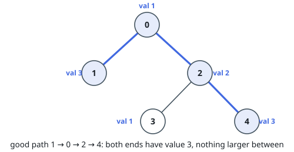
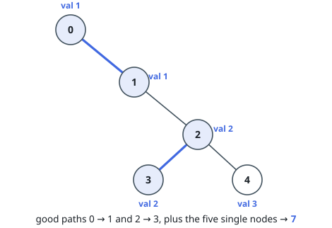
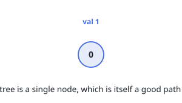

# Number of Good Paths

## Description

There is a tree (i.e. a connected, undirected graph with no cycles) consisting
of `n` nodes numbered from `0` to `n - 1` and exactly `n - 1` edges.

You are given a 0-indexed integer array `vals` of length `n` where `vals[i]`
denotes the value of the `i`th node. You are also given a 2D integer array
`edges` where `edges[i] = [ai, bi]` denotes that there exists an undirected
edge connecting nodes `ai` and `bi`.

A **good path** is a simple path that satisfies the following conditions:

- The starting node and the ending node have the same value.
- All nodes between the starting node and the ending node have values **less
  than or equal to** the starting node (i.e. the starting node's value should
  be the maximum value along the path).

Return the number of distinct good paths.

Note that a path and its reverse are counted as the same path. For example,
`0 -> 1` is considered to be the same as `1 -> 0`. A single node is also
considered as a valid path.

### Example 1

```text
Input: vals = [1,3,2,1,3], edges = [[0,1],[0,2],[2,3],[2,4]]
Output: 6
Explanation: There are 5 good paths consisting of a single node.
There is 1 additional good path: 1 -> 0 -> 2 -> 4.
(The reverse path 4 -> 2 -> 0 -> 1 is treated as the same as 1 -> 0 -> 2 -> 4.)
Note that 0 -> 2 -> 3 is not a good path because vals[2] > vals[0].
```



### Example 2

```text
Input: vals = [1,1,2,2,3], edges = [[0,1],[1,2],[2,3],[2,4]]
Output: 7
Explanation: There are 5 good paths consisting of a single node.
There are 2 additional good paths: 0 -> 1 and 2 -> 3.
```



### Example 3

```text
Input: vals = [1], edges = []
Output: 1
Explanation: The tree consists of only one node, so there is one good path.
```



### Constraints

- `n == vals.length`
- `1 <= n <= 3 * 10⁴`
- `0 <= vals[i] <= 10⁵`
- `edges.length == n - 1`
- `edges[i].length == 2`
- `0 <= ai, bi < n`
- `ai != bi`
- `edges` represents a valid tree.

## Hints

### Hint 1

Can you process nodes from smallest to largest value?

### Hint 2

Try to build the graph from nodes with the smallest value to the largest value.

### Hint 3

May union find help?
