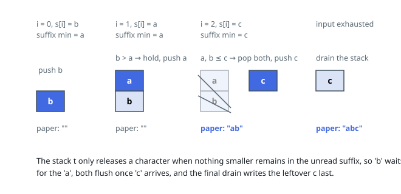

# Solutions — Using a Robot to Print the Lexicographically Smallest String

## Greedy with Suffix Minima and a Stack

The robot's intermediate string `t` behaves exactly like a stack: characters enter `t` in the order they appear in `s` (a push) and can only leave `t` from its end (a pop), each pop appending one character to the paper. So the paper receives some sequence of stack pops, and we must choose the pop order that makes the written string lexicographically smallest.

The greedy rule follows directly: a character sitting on top of `t` should be written now if it is less than or equal to every character that could still arrive from the remaining part of `s`. Writing it can never be wrong, because any character that arrives later is at least as large, so it belongs after the current top in the optimal output. Conversely, if some smaller character is still pending, we must hold the top back and keep pushing until that smaller character is exposed. To apply this rule in constant time per step, precompute `suffix_min[i]`, the smallest character in `s[i..]` (with a sentinel larger than any letter at the end).

The algorithm walks `s` left to right. Before pushing `s[i]`, it repeatedly pops the stack while the top satisfies `top <= suffix_min[i]` — everything popped is guaranteed safe to emit because nothing smaller remains in the unread suffix. Then `s[i]` is pushed. When the input is exhausted, `suffix_min[n]` is the sentinel, so the final drain loop flushes the remaining stack (largest deepest, emitted in reverse insertion order) to finish the paper.

Each character is pushed once and popped once, and the suffix-minimum table is a single right-to-left pass, so the whole run is linear. The equality case in `top <= suffix_min[i]` matters: popping ties early is safe and avoids holding characters unnecessarily. The sentinel `chr(127)` exceeds all lowercase letters, which makes the drain phase just a special case of the main loop's condition.

**Complexity:** `O(n)` time, `O(n)` space.
