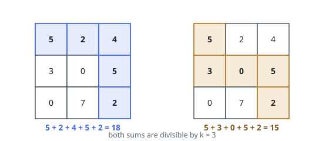
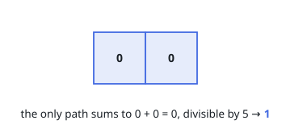
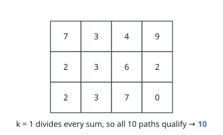

# Paths in Matrix Whose Sum Is Divisible by K

## Description

You are given a 0-indexed `m x n` integer matrix `grid` and an integer
`k`. You are currently at position `(0, 0)` and you want to reach position
`(m - 1, n - 1)` moving only down or right.

Return the number of paths where the sum of the elements on the path is
divisible by `k`. Since the answer may be very large, return it modulo `10^9 + 7`.

### Example 1

```text
Input: grid = [[5,2,4],[3,0,5],[0,7,2]], k = 3
Output: 2
Explanation: There are two paths where the sum of the elements on the path is divisible by k.
The first path has a sum of 5 + 2 + 4 + 5 + 2 = 18 which is divisible by 3.
The second path has a sum of 5 + 3 + 0 + 5 + 2 = 15 which is divisible by 3.
```



### Example 2

```text
Input: grid = [[0,0]], k = 5
Output: 1
Explanation: The path has a sum of 0 + 0 = 0 which is divisible by 5.
```



### Example 3

```text
Input: grid = [[7,3,4,9],[2,3,6,2],[2,3,7,0]], k = 1
Output: 10
Explanation: Every integer is divisible by 1 so the sum of the elements on every possible path is divisible by k.
```



### Constraints

- `m == grid.length`
- `n == grid[i].length`
- `1 <= m, n <= 5 * 10^4`
- `1 <= m * n <= 5 * 10^4`
- `0 <= grid[i][j] <= 100`
- `1 <= k <= 50`

## Hints

### Hint 1

The actual numbers in the grid do not matter. What matters are the remainders you get when you divide the numbers by k.

### Hint 2

Use dynamic programming. Let dp[i][j][value] represent the number of paths where the sum of the elements on the path has a remainder of value when divided by k.

### Hint 3

Only the previous row's states are needed, so the dp can be rolled into one row of size k per column.
