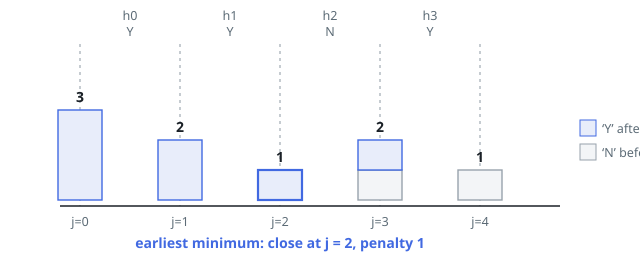

# Solutions — Minimum Penalty for a Shop

## Prefix–Suffix Penalty Sweep

The key observation is that the penalty for closing at hour `j` splits cleanly into two independent counts: the number of `'N'` hours among `customers[:j]` (open hours with no customers) plus the number of `'Y'` hours among `customers[j:]` (closed hours with customers). Instead of recomputing these counts for every candidate `j`, sweep `j` from 0 to `n` while maintaining both quantities incrementally: start with `prefix_n = 0` and `suffix_y` equal to the total number of `'Y'` in the string, which is exactly the penalty for closing at hour 0.

Moving the closing time from `j - 1` to `j` changes the status of exactly one hour, `j - 1`. If that hour is `'N'`, it moves from the closed part to the open part, so `prefix_n` gains one. If it is `'Y'`, it moves from the closed part to the open part and stops contributing, so `suffix_y` loses one. Either way the new penalty is `prefix_n + suffix_y` after the update, and each step costs O(1).

Because the problem asks for the earliest optimal closing hour, the sweep only replaces the best answer on a _strict_ improvement — ties keep the smaller `j` already recorded. Initializing with `best_j = 0` and the hour-0 penalty before the loop handles the case where closing immediately is optimal, such as an all-`'N'` string. An all-`'Y'` string is the opposite extreme: every extension lowers the penalty and the answer is `n`.

**Complexity:** `O(n)` time, `O(1)` space.
