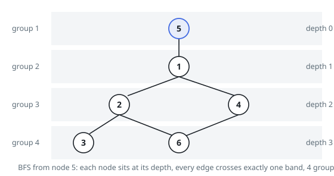

# Solutions — Divide Nodes Into the Maximum Number of Groups

## Per-Component BFS from Every Node

If some node `v` is pinned into the leftmost group of its connected component, every other node's group index is forced: an edge demands adjacent groups, so node `u` must sit at exactly its BFS depth from `v` (any shallower or deeper placement violates some edge along a shortest path). Therefore the maximum group count for a component is `1 + max over v of (BFS depth from v)`, and because components are independent, the answers simply add up.

The algorithm first splits the graph into connected components with an iterative DFS, collecting each component's node list. For every node `source` in a component it then runs a BFS computing distances, tracking the maximum depth reached. The BFS doubles as a bipartiteness test: if an edge ever connects two nodes at the _same_ distance, the component contains an odd cycle, adjacent groups cannot satisfy that edge, and the whole answer is `-1` immediately.

Why trying every root is necessary rather than wasteful: the eccentricity differs per node, and a BFS depth from one root can exceed another's, so all nodes of the component must be tried and the best depth kept. The final contribution of the component is `best + 1` (depths are 0-based, groups 1-indexed).

With `n <= 500`, the cost of `n` BFS runs over adjacency lists is comfortably small even though the graph may hold up to 10^4 edges. Duplicate edges cannot occur per the constraints, and self-loops are excluded, so the parity check only ever sees genuine tree-like or odd-cycle structure within a component.

**Complexity:** `O(n(n + m))` time, `O(n + m)` space.
