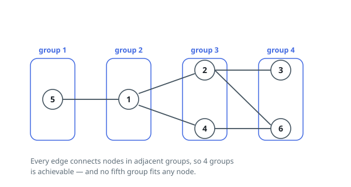

# Divide Nodes Into the Maximum Number of Groups

## Description

You are given a positive integer `n` representing the number of nodes in an
undirected graph. The nodes are labeled from `1` to `n`.

You are also given a 2D integer array `edges`, where `edges[i] = [ai, bi]`
indicates that there is a bidirectional edge between nodes `ai` and `bi`.
Notice that the given graph may be disconnected.

Divide the nodes of the graph into `m` groups (1-indexed) such that:

- Each node in the graph belongs to exactly one group.
- For every pair of nodes in the graph that are connected by an edge
  `[ai, bi]`, if `ai` belongs to the group with index `x`, and `bi` belongs to
  the group with index `y`, then `|y - x| = 1`.

Return the maximum number of groups (i.e., maximum `m`) into which you can
divide the nodes. Return `-1` if it is impossible to group the nodes with the
given conditions.

### Example 1

```text
Input: n = 6, edges = [[1,2],[1,4],[1,5],[2,6],[2,3],[4,6]]
Output: 4
Explanation: As shown in the image we:
- Add node 5 to the first group.
- Add node 1 to the second group.
- Add nodes 2 and 4 to the third group.
- Add nodes 3 and 6 to the fourth group.
We can see that every edge is satisfied.
It can be shown that that if we create a fifth group and move any node from the third or fourth group to it, at least on of the edges will not be satisfied.
```



### Example 2

```text
Input: n = 3, edges = [[1,2],[2,3],[3,1]]
Output: -1
Explanation: If we add node 1 to the first group, node 2 to the second group, and node 3 to the third group to satisfy the first two edges, we can see that the third edge will not be satisfied.
It can be shown that no grouping is possible.
```

### Constraints

- `1 <= n <= 500`
- `1 <= edges.length <= 10⁴`
- `edges[i].length == 2`
- `1 <= ai, bi <= n`
- `ai != bi`
- There is at most one edge between any pair of vertices.

## Hints

### Hint 1

If the graph is not bipartite, it is not possible to group the nodes.

### Hint 2

Solve the problem for each connected component independently; the final answer is the sum of the maximum number of groups in each component.

### Hint 3

For a connected component, if some node v is fixed to be in the leftmost group, every other node's group is forced. Its position is the depth of the node in a BFS tree rooted at v; try every node as the root.
