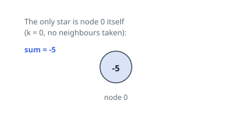

# Maximum Star Sum of a Graph

## Description

There is an undirected graph consisting of `n` nodes numbered from `0` to
`n - 1`. You are given a 0-indexed integer array `vals` of length `n` where
`vals[i]` denotes the value of the `i`th node.

You are also given a 2D integer array `edges` where `edges[i] = [ai, bi]`
denotes that there exists an undirected edge connecting nodes `ai` and `bi`.

A star graph is a subgraph of the given graph having a center node containing
0 or more neighbors. In other words, it is a subset of edges of the given
graph such that there exists a common node for all edges.

The star sum is the sum of the values of all the nodes present in the star
graph.

Given an integer `k`, return the maximum star sum of a star graph containing
at most `k` edges.

### Example 1

```text
Input: vals = [1,2,3,4,10,-10,-20], edges = [[0,1],[1,2],[1,3],[3,4],[3,5],[3,6]], k = 2
Output: 16
Explanation: The star graph with the maximum star sum is centered at node 3
and includes its neighbors 1 and 4.
It can be shown it is not possible to get a star graph with a sum greater
than 16.
```

![Graph with values [1,2,3,4,10,-10,-20]; the star centered at node 3 with neighbours 1 and 4 sums to 16.](figures/example-1.svg)

### Example 2

```text
Input: vals = [-5], edges = [], k = 0
Output: -5
Explanation: There is only one possible star graph, which is node 0 itself.
Hence, we return -5.
```



### Constraints

- `n == vals.length`
- `1 <= n <= 10⁵`
- `-10⁴ <= vals[i] <= 10⁴`
- `0 <= edges.length <= min(n * (n - 1) / 2, 10⁵)`
- `edges[i].length == 2`
- `0 <= ai, bi <= n - 1`
- `ai != bi`
- `0 <= k <= n - 1`

## Hints

### Hint 1

A star graph does not necessarily include all of its neighbors — the center alone is always a valid star.

### Hint 2

For each node, sort its neighbors' values in descending order and greedily take at most k of them, stopping at the first non-positive value.

### Hint 3

The answer is the maximum over all centers of that best sum.
