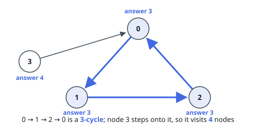
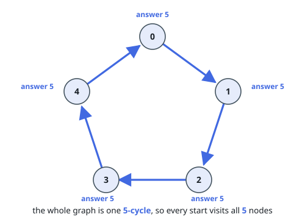

# Count Visited Nodes in a Directed Graph

## Description

There is a directed graph consisting of `n` nodes numbered from `0` to `n - 1`
and `n` directed edges.

You are given a 0-indexed array `edges` where `edges[i]` indicates that there
is an edge from node `i` to node `edges[i]`.

Consider the following process on the graph:

- You start from a node `x` and keep visiting other nodes through edges until
  you reach a node that you have already visited before on this same process.

Return an array `answer` where `answer[i]` is the number of different nodes
that you will visit if you perform the process starting from node `i`.

### Example 1

```text
Input: edges = [1,2,0,0]
Output: [3,3,3,4]
Explanation:
- Starting from node 0, we visit the nodes 0 -> 1 -> 2 -> 0. The number of different nodes we visit is 3.
- Starting from node 1, we visit the nodes 1 -> 2 -> 0 -> 1. The number of different nodes we visit is 3.
- Starting from node 2, we visit the nodes 2 -> 0 -> 1 -> 2. The number of different nodes we visit is 3.
- Starting from node 3, we visit the nodes 3 -> 0 -> 1 -> 2 -> 0. The number of different nodes we visit is 4.
```



### Example 2

```text
Input: edges = [1,2,3,4,0]
Output: [5,5,5,5,5]
Explanation: Starting from any node we can visit every node in the graph in the process.
```



### Constraints

- `n == edges.length`
- `2 <= n <= 10^5`
- `0 <= edges[i] <= n - 1`
- `edges[i] != i`

## Hints

### Hint 1

Consider if the graph was only one cycle; what would the answer be for each node?

### Hint 2

The actual graph always consists of at least one cycle and some other nodes.

### Hint 3

Calculate the answer for nodes in cycles the same way as in hint 1, then figure out how to calculate the answer for the remaining nodes.
