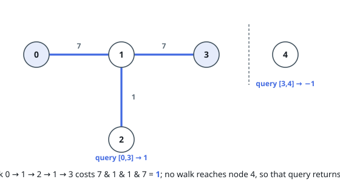
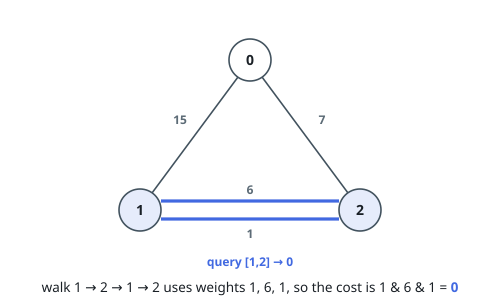

# Minimum Cost Walk in Weighted Graph

## Description

There is an undirected weighted graph with `n` vertices labeled from `0` to
`n - 1`.

You are given the integer `n` and an array `edges`, where
`edges[i] = [ui, vi, wi]` indicates that there is an edge between vertices
`ui` and `vi` with a weight of `wi`.

A walk on a graph is a sequence of vertices and edges. The walk starts and
ends with a vertex, and each edge connects the vertex that comes before it and
the vertex that comes after it. A walk may visit the same edge or vertex more
than once.

The cost of a walk starting at node `u` and ending at node `v` is defined as
the bitwise AND of the weights of the edges traversed during the walk. In
other words, if the sequence of edge weights encountered is
`w0, w1, w2, ..., wk`, then the cost is `w0 & w1 & w2 & ... & wk`, where `&`
denotes the bitwise AND operator.

You are also given a 2D array `query`, where `query[i] = [si, ti]`. For each
query, find the minimum cost of a walk starting at vertex `si` and ending at
vertex `ti`. If there exists no such walk, the answer is `-1`.

Return the array `answer`, where `answer[i]` denotes the minimum cost of a
walk for query `i`.

### Example 1

```text
Input: n = 5, edges = [[0,1,7],[1,3,7],[1,2,1]], query = [[0,3],[3,4]]
Output: [1,-1]
Explanation: To achieve the cost of 1 in the first query, move on the edges
0->1 (weight 7), 1->2 (weight 1), 2->1 (weight 1), 1->3 (weight 7).
In the second query, there is no walk between nodes 3 and 4, so the answer is
-1.
```



### Example 2

```text
Input: n = 3, edges = [[0,2,7],[0,1,15],[1,2,6],[1,2,1]], query = [[1,2]]
Output: [0]
Explanation: To achieve the cost of 0, move on the edges 1->2 (weight 1),
2->1 (weight 6), 1->2 (weight 1).
```



### Constraints

- `2 <= n <= 10⁵`
- `0 <= edges.length <= 10⁵`
- `edges[i].length == 3`
- `0 <= ui, vi <= n - 1`
- `ui != vi`
- `0 <= wi <= 10⁵`
- `1 <= query.length <= 10⁵`
- `query[i].length == 2`
- `0 <= si, ti <= n - 1`
- `si != ti`

## Hints

### Hint 1

The intended solution uses Disjoint Set Union.

### Hint 2

Notice that, if u and v are not connected then the answer is -1; otherwise you can use all the edges from the connected component where both belong.
