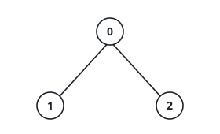
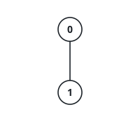
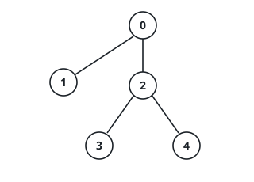

# Time Taken to Mark All Nodes

## Description

There exists an undirected tree with `n` nodes numbered `0` to `n - 1`. You are given a 2D integer array `edges` of length `n - 1`, where `edges[i] = [ui, vi]` indicates that there is an edge between nodes `ui` and `vi` in the tree.

Initially, all nodes are unmarked. For each node `i`:

- If `i` is odd, the node will get marked at time `x` if there is at least one node adjacent to it which was marked at time `x - 1`.
- If `i` is even, the node will get marked at time `x` if there is at least one node adjacent to it which was marked at time `x - 2`.

Return an array `times` where `times[i]` is the time when all nodes get marked in the tree, if you mark node `i` at time `t = 0`.

Note that the answer for each `times[i]` is independent, i.e. when you mark node `i` all other nodes are unmarked.

### Example 1

```text
Input: edges = [[0,1],[0,2]]
Output: [2,4,3]
Explanation: For i = 0: Node 1 is marked at t = 1, and Node 2 at t = 2.
For i = 1: Node 0 is marked at t = 2, and Node 2 at t = 4.
For i = 2: Node 0 is marked at t = 2, and Node 1 at t = 3.
```



### Example 2

```text
Input: edges = [[0,1]]
Output: [1,2]
Explanation: For i = 0: Node 1 is marked at t = 1.
For i = 1: Node 0 is marked at t = 2.
```



### Example 3

```text
Input: edges = [[2,4],[0,1],[2,3],[0,2]]
Output: [4,6,3,5,5]
```



### Constraints

- `2 <= n <= 10⁵`
- `edges.length == n - 1`
- `edges[i].length == 2`
- `0 <= edges[i][0], edges[i][1] <= n - 1`
- The input is generated such that `edges` represents a valid tree.

## Hints

### Hint 1

Can we use dp on trees?

### Hint 2

Store the two most distant children for each node.

### Hint 3

When re-rooting the tree, keep a variable for distance to the root node.
