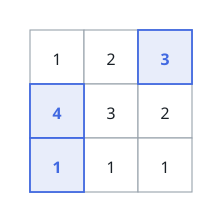
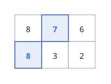

# Select Cells in Grid With Maximum Score

## Description

You are given a 2D matrix `grid` consisting of positive integers.

You have to select one or more cells from the matrix such that the following conditions are satisfied:

- No two selected cells are in the same row of the matrix.
- The values in the set of selected cells are unique.

Your score will be the sum of the values of the selected cells.

Return the maximum score you can achieve.

### Example 1

```text
Input: grid = [[1,2,3],[4,3,2],[1,1,1]]
Output: 8
Explanation: We can select the cells with values 1, 3, and 4 that are colored above.
```



### Example 2

```text
Input: grid = [[8,7,6],[8,3,2]]
Output: 15
Explanation: We can select the cells with values 7 and 8 that are colored above.
```



### Constraints

- `1 <= grid.length, grid[i].length <= 10`
- `1 <= grid[i][j] <= 100`

## Hints

### Hint 1

Sort all the cells in the grid by their values and keep track of their original positions.

### Hint 2

Try dynamic programming with the following states: the current cell that we might select and a bitmask representing all the rows from which we have already selected a cell so far.
